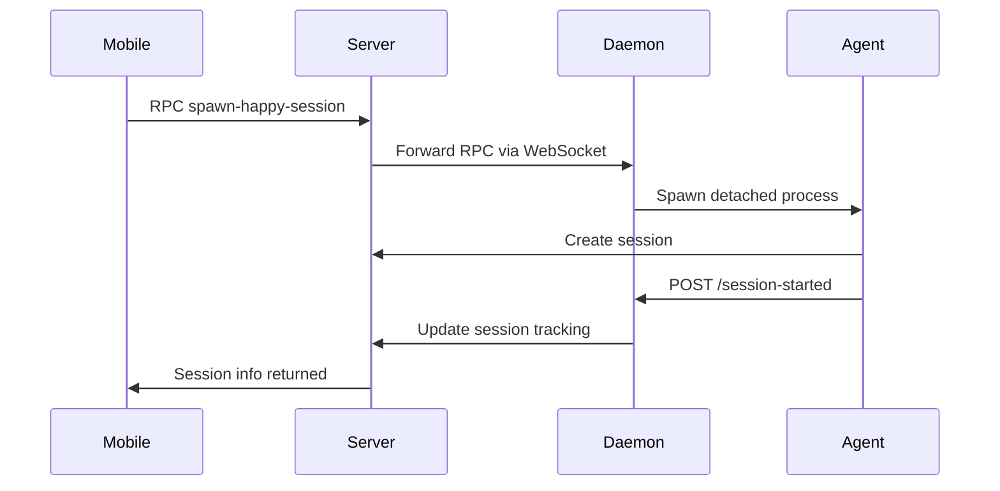

The Happy CLI (`happy-coder` package) wraps Claude Code and Codex to enable remote control from mobile and web clients. It runs as a daemon process that manages AI agent sessions, handles authentication, and provides end-to-end encrypted communication.

## Overview

The CLI acts as a bridge between your local development environment and the Happy mobile/web apps, allowing you to:

- Control Claude Code and Codex from anywhere
- Share session state in real-time with mobile devices
- Manage multiple AI agent sessions simultaneously
- Auto-update when new CLI versions are installed

## Architecture

<CardGroup cols={2}>
  <Card title="Daemon Process" icon="server">
    Persistent background service that manages sessions, WebSocket connections, and auto-updates
  </Card>
  <Card title="Session Management" icon="layer-group">
    Tracks both daemon-spawned (remote) and terminal-spawned (local) sessions
  </Card>
  <Card title="Authentication" icon="shield">
    QR code-based auth using TweetNaCl cryptographic signatures with challenge-response
  </Card>
  <Card title="Real-time Sync" icon="arrows-rotate">
    WebSocket connection to backend for bidirectional communication and RPC
  </Card>
</CardGroup>

## Key Modules

### Agent Integration (`/src/agent/`)

Supports multiple AI agent backends:

- **ACP (Agent Client Protocol)**: Primary integration layer for Claude Code and Codex
- **Message Adapters**: Convert between agent-specific formats and mobile-friendly JSON
- **Agent Registry**: Manages multiple agent types (Claude, Gemini, Codex)
- **Session Manager**: Handles agent lifecycle, state persistence, and resumption

### Daemon (`/src/daemon/`)

Persistent background service with:

- **Auto-update detection**: Monitors `package.json` for version changes every 60s
- **Process management**: Spawns and tracks child sessions, handles cleanup
- **HTTP control server**: Local-only API (127.0.0.1) for session control
- **Lock files**: Prevents multiple daemon instances
- **State persistence**: Writes PID, port, and version to `daemon.state.json`

<Accordion title="Daemon Lifecycle">
  1. **Startup**: Acquires exclusive lock, authenticates, starts HTTP server and WebSocket
  2. **Heartbeat**: Every 60s checks for version updates and prunes dead sessions
  3. **Auto-update**: Spawns new daemon when CLI upgrade detected, old daemon waits to be killed
  4. **Shutdown**: Updates backend status, disconnects WebSocket, cleans up state files
</Accordion>

### API Client (`/src/api/`)

Handles server communication:

- **Authentication**: Challenge-response flow with TweetNaCl signatures
- **Session API**: Create, list, update, and delete sessions
- **Machine API**: Register machines and sync daemon state
- **WebSocket**: Real-time updates via Socket.IO with automatic reconnection
- **Encryption**: End-to-end encryption for all sensitive data

### UI Components (`/src/ui/`)

- **Logger**: File-based logging (avoids interfering with Claude's terminal UI)
- **QR Code**: Terminal-rendered QR codes for mobile authentication
- **Doctor Command**: Diagnostics and process cleanup utilities

## Core Dependencies

```json
{
  "@anthropic-ai/sandbox-runtime": "^0.0.37",
  "@modelcontextprotocol/sdk": "^1.25.3",
  "@agentclientprotocol/sdk": "^0.14.1",
  "fastify": "^5.6.2",
  "socket.io-client": "^4.8.1",
  "tweetnacl": "^1.0.3",
  "ink": "^6.5.1",
  "zod": "3.25.76"
}
```

## Scripts

<AccordionGroup>
  <Accordion title="Development">
    - `yarn dev` - Run CLI from source with tsx
    - `yarn dev:local-server` - Run with local server environment
    - `yarn build` - TypeScript check and build with pkgroll
    - `yarn test` - Build and run Vitest tests
  </Accordion>

  <Accordion title="Daemon Management">
    - `yarn stable:daemon:start` - Start stable daemon
    - `yarn stable:daemon:stop` - Stop stable daemon
    - `yarn stable:daemon:status` - Check daemon status
    - `yarn dev:daemon:start` - Start development daemon
    - `yarn doctor` - Run diagnostics
  </Accordion>

  <Accordion title="Variants">
    The CLI supports stable/dev variants for testing:
    - `yarn stable` - Run stable variant
    - `yarn dev:variant` - Run dev variant
    - Uses separate home directories (`.happy` vs `.happy-dev`)
  </Accordion>
</AccordionGroup>

## Entry Points

- **Main binary**: `./bin/happy.mjs` - Primary CLI command
- **MCP bridge**: `./bin/happy-mcp.mjs` - Model Context Protocol integration
- **Module exports**: `./dist/index.mjs` - Programmatic API

## Session Management Flow



## Configuration

Settings stored in `~/.happy/` (or `$HAPPY_HOME_DIR`):

- `access.key` - TweetNaCl secret key for authentication
- `settings.json` - Machine ID, profiles, environment variables
- `daemon.state.json` - Current daemon PID, port, version, log path
- `logs/` - Timestamped log files

## Platform Support

- **macOS**: Full support with tmux integration and caffeinate
- **Linux**: Full support
- **Windows**: Experimental support

## Design Principles

1. **File-based logging**: Prevents interference with Claude's terminal UI
2. **Dual integration**: Process spawning for interactive, SDK for remote
3. **End-to-end encryption**: All data encrypted before leaving device
4. **Session persistence**: Resume sessions across restarts
5. **Optimistic concurrency**: Handles distributed state updates gracefully

## Related Components

- [Server](/components/server) - Backend API and WebSocket server
- [Mobile App](/components/mobile-app) - React Native client
- [Agent](/components/agent) - Remote control CLI
