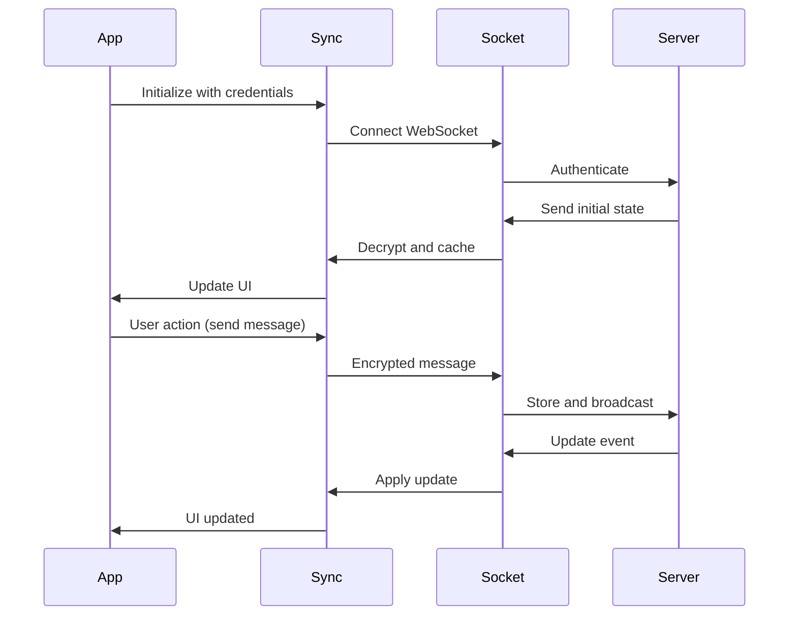

The Happy mobile app is a cross-platform React Native application that provides remote control of Claude Code and Codex sessions. It supports iOS, Android, and web browsers with end-to-end encryption and real-time synchronization.

## Overview

The mobile app enables users to:

- Control AI coding sessions from mobile devices
- Monitor real-time session activity and logs
- Approve or deny tool execution requests
- Participate in voice conversations with AI agents
- Manage multiple machines and sessions

## Technology Stack

<CardGroup cols={2}>
  <Card title="React Native" icon="react">
    Built on React Native 0.81.4 with Expo SDK 54 for cross-platform development
  </Card>
  <Card title="Real-time Sync" icon="rotate">
    Socket.IO WebSocket connection with end-to-end encryption using libsodium
  </Card>
  <Card title="Voice Communication" icon="microphone">
    LiveKit integration for real-time voice conversations with AI agents
  </Card>
  <Card title="Responsive Design" icon="mobile-screen">
    Unistyles for theme-aware, responsive styling across all screen sizes
  </Card>
</CardGroup>

## Architecture

### Project Structure

```
sources/
├── app/              # Expo Router file-based screens
│   └── (app)/        # Authenticated app screens
├── auth/             # QR code authentication logic
├── components/       # Reusable UI components
├── sync/             # Real-time sync engine
│   ├── sync.ts       # Main sync orchestrator
│   ├── apiSocket.ts  # WebSocket communication
│   ├── encryption/   # E2E encryption utilities
│   └── reducer/      # State management
├── realtime/         # LiveKit voice integration
├── hooks/            # Custom React hooks
└── utils/            # Utility functions
```

### Core Technology Choices

**Navigation**: Expo Router v6 (file-based routing)
**Styling**: Unistyles with theme support and breakpoints
**State Management**: React Context + custom reducers
**Encryption**: libsodium via `@more-tech/react-native-libsodium`
**Storage**: MMKV for fast key-value storage
**Networking**: Socket.IO + Axios

## Key Features

### Authentication Flow

QR code-based authentication using challenge-response:

1. CLI displays QR code with auth challenge
2. Mobile app scans QR with expo-camera
3. App signs challenge with stored secret key
4. Server validates signature and issues token

<Note>
  All authentication uses TweetNaCl cryptographic signatures. No passwords are ever transmitted.
</Note>

### Real-time Synchronization

The `Sync` class in `sources/sync/sync.ts` handles:

- **WebSocket connection**: Persistent Socket.IO connection with auto-reconnect
- **Message encryption**: All sensitive data encrypted with libsodium
- **State updates**: Real-time session, message, and machine state changes
- **Optimistic updates**: Local changes applied immediately, synced in background
- **Conflict resolution**: Version-based concurrency control

<Accordion title="Sync Architecture">
  ```typescript
  class Sync {
    encryption: Encryption              // E2E encryption utilities
    encryptionCache: EncryptionCache    // Session key caching
    sessionsSync: InvalidateSync        // Session list invalidation
    messagesSync: Map<string, InvalidateSync>  // Per-session message sync
    sendSync: Map<string, InvalidateSync>      // Message send coordination
    storage: Storage                    // Local persistence layer
  }
  ```
</Accordion>

### Voice Communication

LiveKit integration for voice sessions:

- Real-time voice input/output
- ElevenLabs integration for text-to-speech
- Audio API for voice processing
- Background audio support

## Core Dependencies

```json
{
  "expo": "^54.0.0",
  "react-native": "0.81.4",
  "react": "19.1.0",
  "@slopus/happy-wire": "^0.1.0",
  "socket.io-client": "^4.8.1",
  "libsodium-wrappers": "0.8.2",
  "@more-tech/react-native-libsodium": "^1.5.5",
  "@livekit/react-native": "^2.9.0",
  "react-native-unistyles": "^3.0.21",
  "expo-router": "~6.0.7",
  "react-native-mmkv": "^3.3.3",
  "zod": "3.25.76"
}
```

## Platform Support

### Mobile

- **iOS**: Full native support via Expo
- **Android**: Full native support via Expo

### Web

- Web version shares same codebase (React Native Web)
- Deployed at `app.happy.engineering`
- Secondary platform with some limitations

### Desktop

- **macOS**: Tauri-based desktop app
  - `yarn tauri:dev` - Development with hot reload
  - `yarn tauri:build:production` - Production build

## Scripts

<AccordionGroup>
  <Accordion title="Development">
    - `yarn start` - Start Expo development server
    - `yarn ios` - Run on iOS simulator
    - `yarn android` - Run on Android emulator
    - `yarn web` - Run in web browser
    - `yarn typecheck` - TypeScript validation (run after all changes)
  </Accordion>

  <Accordion title="Environment Variants">
    - `yarn ios:dev` - iOS with development env
    - `yarn ios:preview` - iOS with preview env
    - `yarn ios:production` - iOS with production env
    - Same variants for `android:*` and `start:*`
  </Accordion>

  <Accordion title="Over-the-Air Updates">
    - `yarn ota` - Deploy OTA update to preview
    - `yarn ota:production` - Deploy OTA update to production
    - Uses Expo EAS Update
  </Accordion>

  <Accordion title="Builds">
    - `yarn prebuild` - Generate native iOS/Android directories
    - `yarn release:build:appstore` - Build for App Store submission
    - `yarn release:build:developer` - Build development variants
  </Accordion>
</AccordionGroup>

## Styling with Unistyles

All styling uses Unistyles for theme-aware, responsive design:

```typescript
import { StyleSheet } from 'react-native-unistyles'

const styles = StyleSheet.create((theme, runtime) => ({
  container: {
    flex: 1,
    backgroundColor: theme.colors.background,
    paddingTop: runtime.insets.top,
    paddingHorizontal: theme.margins.md,
  },
  text: {
    color: theme.colors.typography,
    fontSize: 16,
  }
}))
```

<Note>
  For Expo Image components, `width`, `height`, and `tintColor` must be set outside of Unistyles as inline props.
</Note>

## Internationalization

Full i18n support using the `t()` function:

- **Languages**: English, Russian, Polish, Spanish, Catalan, Italian, Portuguese, Japanese, Chinese (Simplified)
- **Centralized**: Language metadata in `sources/text/_all.ts`
- **Translation files**: `sources/text/translations/[code].ts`

```typescript
import { t } from '@/text'

// Simple constants
t('common.cancel')  // "Cancel"

// Dynamic with parameters
t('common.welcome', { name: 'Steve' })  // "Welcome, Steve!"
```

## Data Flow



## Design Principles

1. **Always use translation function**: All user-visible strings via `t()`
2. **Never show loading errors**: Always retry, never block user
3. **Invalidate sync for main data**: Use `InvalidateSync` pattern
4. **No backward compatibility**: Move fast, clean migrations
5. **Always use `useHappyAction`**: Consistent async operation handling
6. **Layout width constraints**: Responsive design via `@/components/layout`
7. **Run typecheck after changes**: Ensure type safety with `yarn typecheck`

## Configuration

App configuration via `sources/sync/appConfig.ts`:

- Environment variants (development, preview, production)
- Server URLs
- Feature flags
- Platform-specific settings

## Related Components

- [CLI](/components/cli) - Command-line daemon and agent wrapper
- [Server](/components/server) - Backend API and WebSocket server
- [Web App](/components/web-app) - Web version (same codebase)
