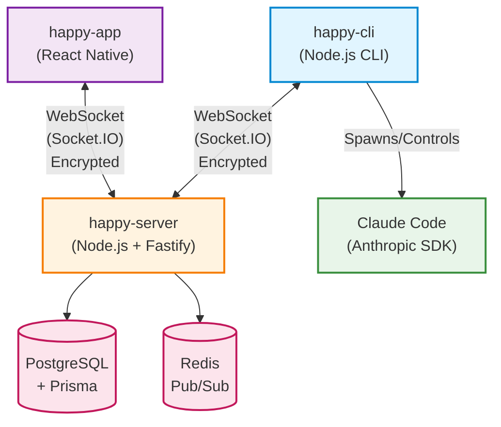
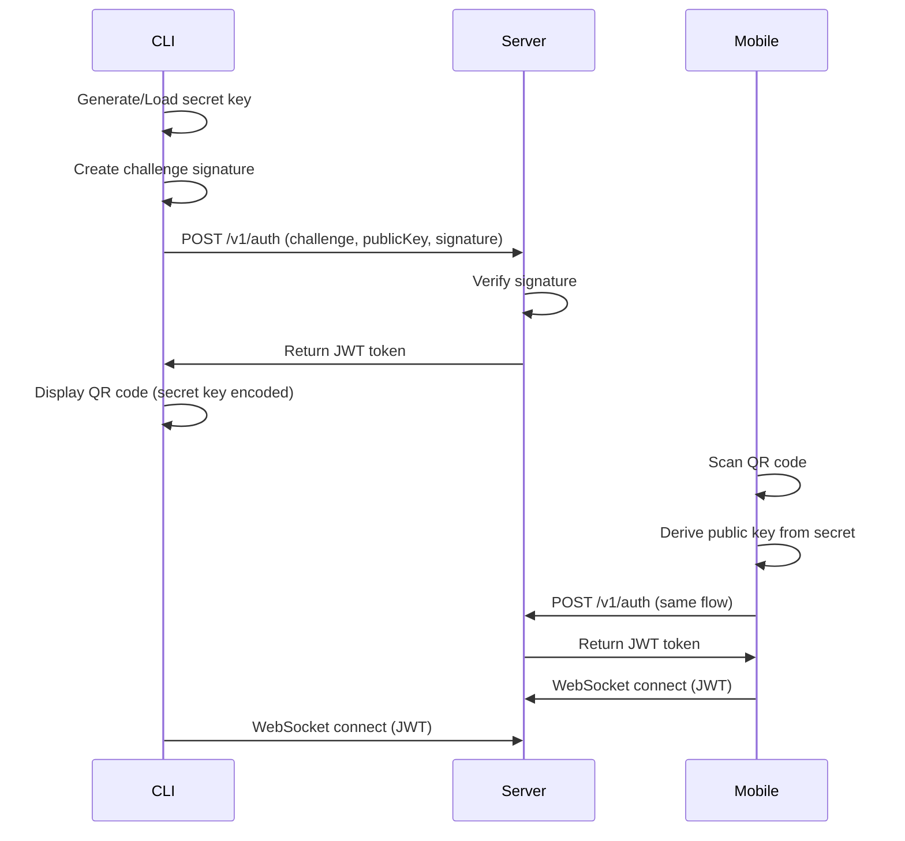
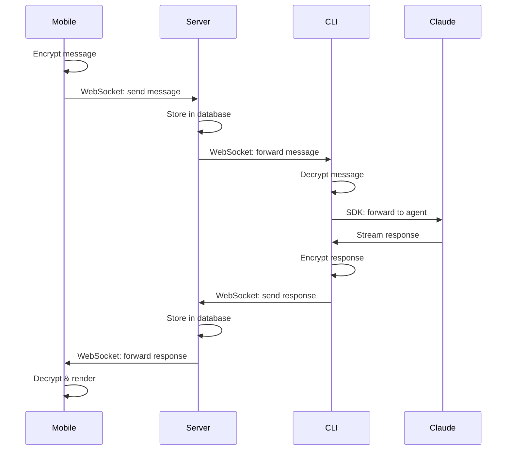
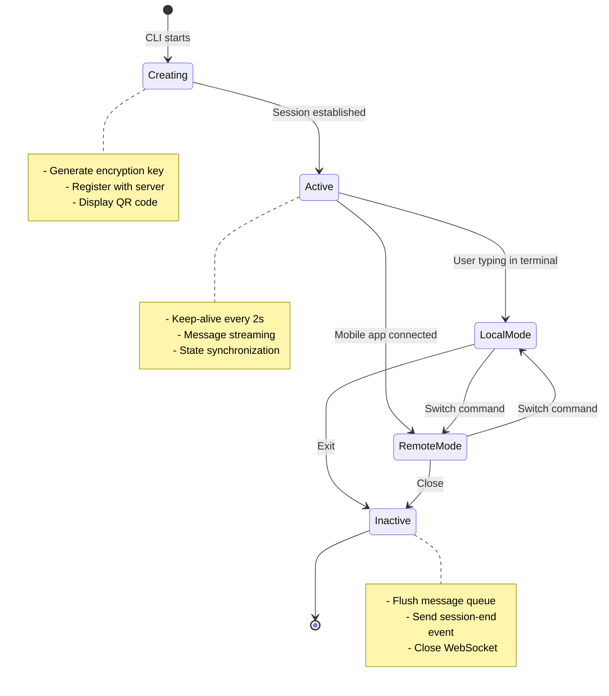

# System Architecture

Happy is a distributed system that enables remote control of AI coding agents through mobile devices. The architecture consists of three main components that communicate through encrypted channels.

## Component Overview



## Monorepo Structure

The codebase is organized as a Yarn monorepo with five packages:

<CodeGroup>
```json package.json:10-16
"workspaces": {
    "packages": [
        "packages/happy-app",
        "packages/happy-agent",
        "packages/happy-cli",
        "packages/happy-server",
        "packages/happy-wire"
    ]
}
```
</CodeGroup>

### Package Responsibilities

<CardGroup cols={2}>
  <Card title="happy-cli" icon="terminal">
    Command-line tool that wraps AI agents (Claude Code, Gemini, Codex) and enables remote control from mobile devices.
    
    **Technologies**: Node.js, TypeScript, Socket.IO Client, TweetNaCl
  </Card>
  
  <Card title="happy-server" icon="server">
    Central coordination server handling authentication, message routing, and state synchronization.
    
    **Technologies**: Node.js, Fastify, Socket.IO Server, PostgreSQL, Prisma, Redis
  </Card>
  
  <Card title="happy-app" icon="mobile">
    React Native mobile application for iOS and Android providing remote agent control.
    
    **Technologies**: React Native, Expo, Socket.IO Client, TweetNaCl
  </Card>
  
  <Card title="happy-wire" icon="shapes">
    Shared protocol definitions and message schemas used across all components.
    
    **Technologies**: TypeScript, Zod
  </Card>
  
  <Card title="happy-agent" icon="robot">
    Shared agent utilities and common functionality (legacy, being consolidated).
    
    **Technologies**: TypeScript
  </Card>
</CardGroup>

## CLI Architecture (happy-cli)

### Directory Structure

```
packages/happy-cli/src/
├── api/              # Server communication layer
│   ├── api.ts       # Session & machine management
│   ├── apiSession.ts # WebSocket client for real-time sync
│   ├── auth.ts      # Challenge-response authentication
│   ├── encryption.ts # TweetNaCl encryption layer
│   └── rpc/         # RPC handler system
├── claude/          # Claude Code integration
│   ├── loop.ts      # Main control loop (local/remote modes)
│   ├── session.ts   # Session lifecycle management
│   ├── claudeSdk.ts # Anthropic SDK integration
│   └── utils/       # Protocol mapping utilities
├── ui/              # User interface components
│   ├── logger.ts    # File-based logging system
│   └── qrcode.ts    # QR code generation for auth
├── modules/         # Feature modules
│   └── common/      # Common RPC handlers
└── persistence.ts   # Local settings & key storage
```

### Key Components

<Accordion title="API Layer (packages/happy-cli/src/api/)">
The API layer handles all communication with the server:

- **ApiClient** (`api.ts:13`): Creates and manages sessions, handles authentication tokens
- **ApiSessionClient** (`apiSession.ts:74`): WebSocket-based real-time client with RPC support
- **Encryption** (`encryption.ts`): End-to-end encryption using TweetNaCl
- **RPC System** (`rpc/`): Remote procedure call handlers for mobile-initiated actions

**Session Creation Flow**:
1. Generate encryption key (either legacy secret-based or new data key)
2. Encrypt metadata and agent state
3. POST to `/v1/sessions` with tag for deduplication
4. Establish WebSocket connection for real-time updates
</Accordion>

<Accordion title="Claude Integration (packages/happy-cli/src/claude/)">
Integration with Claude Code through Anthropic's SDK:

- **loop.ts:47**: Main control loop alternating between local (terminal) and remote (mobile) modes
- **session.ts:8**: Session state management with keep-alive mechanism
- **claudeSdk.ts**: Direct SDK integration using `@anthropic-ai/claude-code`
- **Protocol Mapper**: Converts Claude's message format to Happy's Session Protocol

**Dual Mode Operation**:
- **Local Mode**: User interacts directly with Claude in terminal
- **Remote Mode**: Mobile app sends messages, CLI forwards to Claude
</Accordion>

<Accordion title="Persistence Layer (packages/happy-cli/src/persistence.ts)">
Local storage for configuration and credentials:

- **Private Keys**: Stored in `~/.happy/access.key` (or `$HAPPY_HOME_DIR`)
- **Settings**: Machine metadata, sandbox config, AI backend profiles
- **Encryption**: All sensitive data encrypted before storage

**Storage Locations**:
- Global: `~/.happy/` (production) or `~/.happy-dev/` (development)
- Local: `.happy/` in current directory (project-specific overrides)
</Accordion>

## Server Architecture (happy-server)

### Directory Structure

```
packages/happy-server/sources/
├── app/
│   ├── api/
│   │   ├── routes/          # RESTful API endpoints
│   │   └── socket/          # WebSocket event handlers
│   ├── events/
│   │   └── eventRouter.ts   # Central event distribution
│   └── presence/
│       └── sessionCache.ts  # Active session tracking
├── storage/
│   ├── db.ts               # Prisma database client
│   └── seq.ts              # Sequence allocation
└── services/
    └── pubsub.ts           # Redis pub/sub for scaling
```

### Core Services

<AccordionGroup>
  <Accordion title="Event Router (app/events/eventRouter.ts)">
  Central hub for distributing updates across connected clients:
  
  - Maintains map of user ID → connected sockets
  - Routes messages based on recipient filters (user-scoped, session-scoped)
  - Implements optimistic concurrency control with sequence numbers
  - Skips sender connection to avoid echo
  </Accordion>
  
  <Accordion title="Session Management (app/api/routes/sessionRoutes.ts)">
  RESTful endpoints for session lifecycle:
  
  - `POST /v1/sessions`: Create or retrieve session by tag
  - `GET /v3/sessions/:id/messages`: Fetch message history
  - `POST /v3/sessions/:id/messages`: Send message batch
  
  **Tag-based Deduplication**: Same tag returns existing session
  </Accordion>
  
  <Accordion title="WebSocket Handlers (app/api/socket/)">
  Real-time bidirectional communication:
  
  - `sessionUpdateHandler.ts:11`: Metadata/state updates, keep-alive pings
  - `machineUpdateHandler.ts`: Machine registration and daemon state
  - `accessKeyHandler.ts`: RPC request routing between clients
  
  **Connection Types**:
  - `user-scoped`: Mobile app (receives all user's updates)
  - `session-scoped`: CLI (receives only specific session updates)
  - `machine-scoped`: CLI daemon (receives machine-specific updates)
  </Accordion>
  
  <Accordion title="Presence System (app/presence/sessionCache.ts)">
  Tracks active sessions and online machines:
  
  - In-memory cache with Redis backing
  - Periodic database sync for last-active timestamps
  - Efficient broadcast of session activity updates
  </Accordion>
</AccordionGroup>

### Database Schema

The server uses PostgreSQL with Prisma ORM:

- **Account**: User accounts with authentication
- **Session**: AI agent sessions with encrypted metadata
- **SessionMessage**: Message history with sequence numbers
- **Machine**: Registered CLI instances per user
- **AccessKey**: Long-lived authentication tokens

## Mobile Architecture (happy-app)

### Key Features

<CardGroup cols={2}>
  <Card title="Session List" icon="list">
    Real-time view of all active and recent sessions across machines
  </Card>
  
  <Card title="Message Stream" icon="messages">
    Live feed of agent messages, tool calls, and file edits
  </Card>
  
  <Card title="Remote Control" icon="gamepad">
    Send messages to agent, approve permissions, switch modes
  </Card>
  
  <Card title="Multi-Device Sync" icon="arrows-rotate">
    All data synchronized across multiple mobile devices
  </Card>
</CardGroup>

### State Management

The mobile app uses a custom reducer pattern:

- **Storage**: Local-first with remote sync
- **Optimistic Updates**: Immediate UI response before server confirmation
- **Event Processing**: Incoming messages processed through reducer
- **Protocol Support**: Handles both legacy and new Session Protocol formats

## Communication Patterns

### Authentication Flow



**Security**: Challenge-response prevents replay attacks. Secret key never transmitted.

### Message Flow (Remote Mode)



### Session Lifecycle



## Scaling Considerations

<AccordionGroup>
  <Accordion title="Horizontal Scaling">
  The server can be scaled horizontally:
  
  - **Redis Pub/Sub**: Distributes events across server instances
  - **Stateless Design**: No server-side session state (all in database)
  - **Load Balancer**: WebSocket sticky sessions required
  </Accordion>
  
  <Accordion title="Performance Optimizations">
  - **In-Memory Caching**: Session presence cached in memory
  - **Batch Operations**: Message outbox flushes in batches
  - **Sequence Allocation**: Pre-allocated sequence ranges reduce DB queries
  - **Volatile Events**: Keep-alive pings don't persist to database
  </Accordion>
  
  <Accordion title="Database Optimization">
  - **Indexes**: Composite indexes on (accountId, sessionId, seq)
  - **Partitioning**: Messages table partitioned by date (future)
  - **Archival**: Old sessions archived to cold storage (future)
  </Accordion>
</AccordionGroup>

## Error Handling

### Network Resilience

- **Automatic Reconnection**: WebSocket reconnects with exponential backoff
- **Offline Mode**: CLI continues working when server unreachable
- **Message Queuing**: Outbound messages queued until connection restored
- **Version Conflicts**: Optimistic concurrency with automatic retry

### Encryption Failures

- **Key Mismatch**: Client displays error, prevents message corruption
- **Decryption Failure**: Message logged but skipped (no crash)
- **Legacy Support**: Falls back to legacy encryption format if needed

## Development Setup

See [Development Setup](/development/setup) for detailed instructions on running the full stack locally.

## Next Steps

<CardGroup cols={2}>
  <Card title="Data Flow" href="/development/data-flow" icon="diagram-project">
    Understand message routing between components
  </Card>
  
  <Card title="Encryption Layer" href="/development/encryption-layer" icon="lock">
    Deep dive into TweetNaCl implementation
  </Card>
  
  <Card title="Session Lifecycle" href="/development/session-lifecycle" icon="circle-nodes">
    Learn session creation and management
  </Card>
  
  <Card title="Server Component" href="/components/server" icon="server">
    Explore server architecture details
  </Card>
</CardGroup>