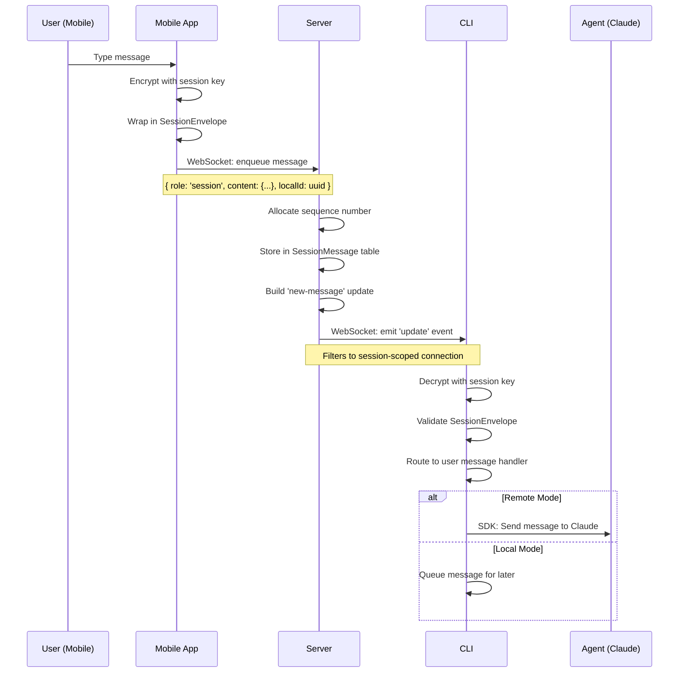
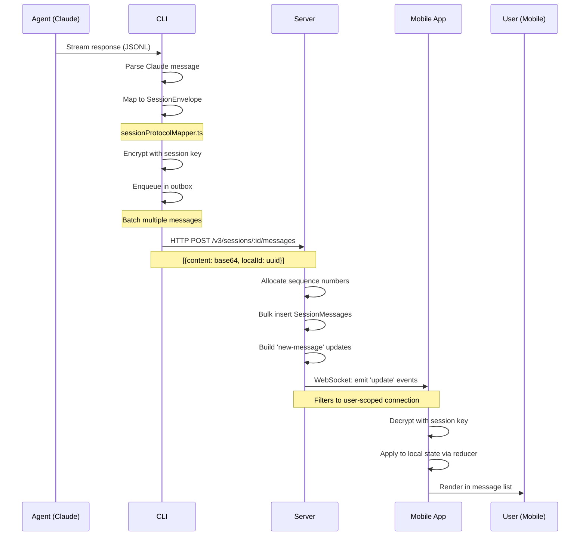
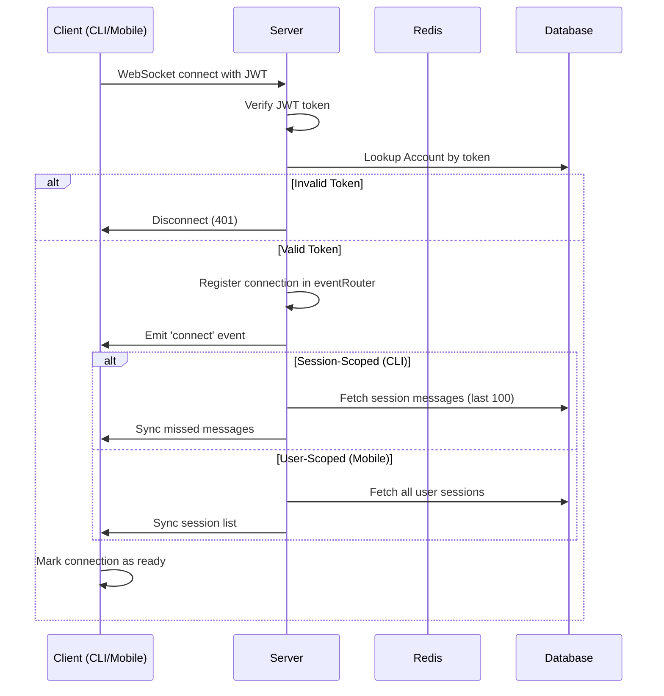
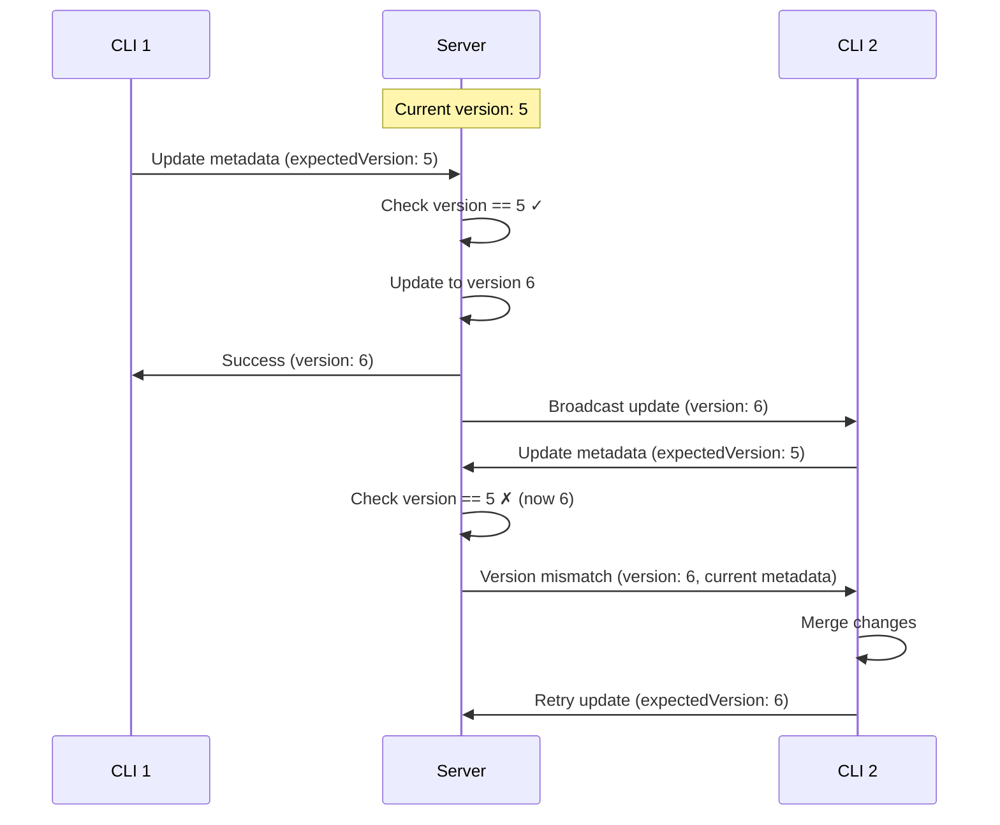
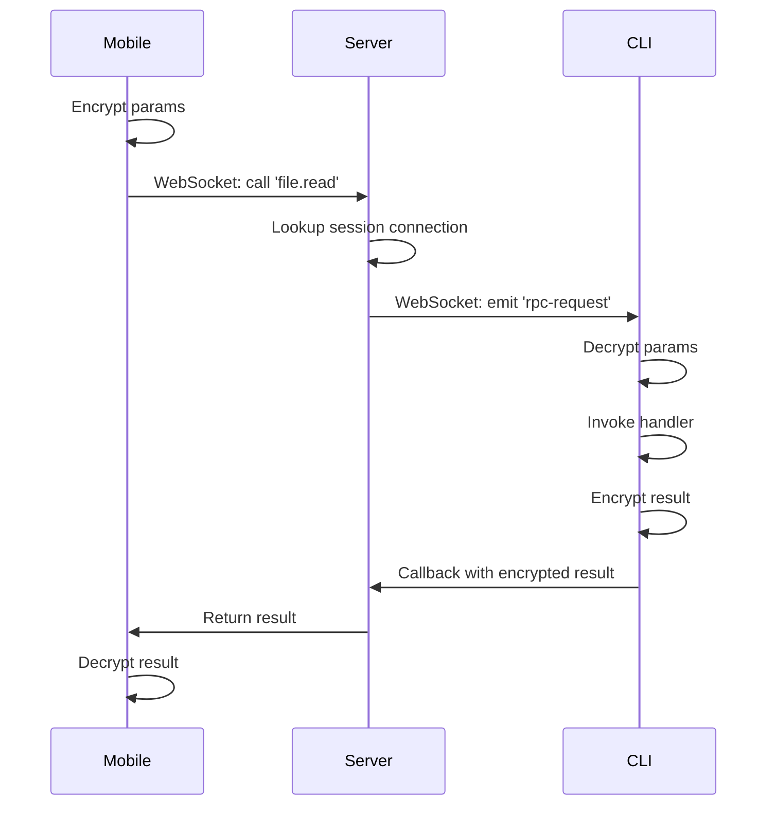

# Data Flow

This document explains how messages flow through the Happy system, from user input to agent response and back to the mobile device.

## Message Types

Happy supports multiple message formats to accommodate different agent types:

### Session Protocol (New)

The modern message format used by Claude Code and other agents:

```typescript
type SessionEnvelope = {
  role: 'user' | 'agent' | 'system'
  ev: SessionEvent  // Event payload
  meta?: {
    sentFrom?: 'cli' | 'mobile'
    timestamp?: number
  }
}
```

**Event Types**:
- `text`: User/agent text messages
- `tool-call`: Agent invoking a tool
- `tool-result`: Tool execution result
- `file-edit`: File modification
- `thinking`: Agent reasoning
- `turn-start`/`turn-end`: Conversation turn boundaries

### Legacy Protocol

Older format still supported for backward compatibility:

```typescript
type LegacyMessage = {
  role: 'user' | 'agent'
  content: {
    type: 'text' | 'tool_use' | 'tool_result'
    text?: string
    // ... other fields
  }
}
```

### ACP (Agent Communication Protocol)

Unified format for generic agent messages:

```typescript
type ACPMessage = {
  role: 'agent'
  content: {
    type: 'acp'
    provider: 'gemini' | 'codex' | 'claude' | 'opencode'
    data: ACPMessageData  // Normalized message data
  }
}
```

See `packages/happy-cli/src/api/apiSession.ts:27` for full ACP message types.

## End-to-End Message Flow

### User Message (Mobile → CLI)



**Implementation**: `packages/happy-cli/src/api/apiSession.ts:229` (onUserMessage handler)

### Agent Response (CLI → Mobile)



**Implementation**: 
- CLI mapping: `packages/happy-cli/src/claude/utils/sessionProtocolMapper.ts`
- CLI sending: `packages/happy-cli/src/api/apiSession.ts:352` (sendClaudeSessionMessage)
- Server handling: `packages/happy-server/sources/app/api/routes/v3SessionRoutes.ts`

## WebSocket Communication

### Connection Establishment



**Connection Types**:

<Tabs>
  <Tab title="user-scoped">
    **Used by**: Mobile app
    
    **Receives**:
    - All sessions owned by user
    - All messages across sessions
    - Machine online status
    - Session activity updates
    
    **Auth payload**:
    ```typescript
    {
      token: string
      clientType: 'user-scoped'
    }
    ```
  </Tab>
  
  <Tab title="session-scoped">
    **Used by**: CLI in session mode
    
    **Receives**:
    - Messages for specific session only
    - Session metadata/state updates
    - RPC requests from mobile
    
    **Auth payload**:
    ```typescript
    {
      token: string
      clientType: 'session-scoped'
      sessionId: string
    }
    ```
  </Tab>
  
  <Tab title="machine-scoped">
    **Used by**: CLI daemon
    
    **Receives**:
    - Machine-specific updates
    - Daemon state changes
    - Global commands
    
    **Auth payload**:
    ```typescript
    {
      token: string
      clientType: 'machine-scoped'
      machineId: string
    }
    ```
  </Tab>
</Tabs>

### Event Types

#### Server → Client Events

<AccordionGroup>
  <Accordion title="'update' - New Message or State Change">
  Primary event for delivering updates to clients.
  
  **Payload**:
  ```typescript
  {
    seq: number       // Global sequence for ordering
    key: string       // Unique update ID
    body: UpdateBody
  }
  ```
  
  **Body Types**:
  - `new-message`: New message in session
  - `update-session`: Metadata or state changed
  - `update-machine`: Machine metadata changed
  
  **Implementation**: `packages/happy-server/sources/app/events/eventRouter.ts:buildNewMessageUpdate`
  </Accordion>
  
  <Accordion title="'rpc-request' - Remote Procedure Call">
  Mobile app invoking function on CLI.
  
  **Payload**:
  ```typescript
  {
    method: string    // e.g., 'file.read', 'dir.list'
    params: string    // Encrypted JSON params
  }
  ```
  
  **Response**: Client calls callback with encrypted result
  
  **Implementation**: `packages/happy-cli/src/api/apiSession.ts:158`
  </Accordion>
  
  <Accordion title="'session-activity' (Ephemeral)">
  Real-time presence indicator for sessions.
  
  **Payload**:
  ```typescript
  {
    sessionId: string
    active: boolean
    thinking: boolean
    lastActiveAt: number
  }
  ```
  
  **Note**: Not persisted to database, sent only to connected clients
  </Accordion>
</AccordionGroup>

#### Client → Server Events

<AccordionGroup>
  <Accordion title="'message' - Send Message (Legacy)">
  **Deprecated**: Use HTTP POST instead for better reliability
  
  **Payload**:
  ```typescript
  {
    sid: string       // Session ID
    message: string   // Encrypted base64 content
    localId?: string  // Client-generated UUID
  }
  ```
  
  **Implementation**: `packages/happy-server/sources/app/api/socket/sessionUpdateHandler.ts:186`
  </Accordion>
  
  <Accordion title="'session-alive' - Keep-Alive Ping">
  Sent every 2 seconds by CLI to indicate session is active.
  
  **Payload**:
  ```typescript
  {
    sid: string
    time: number
    thinking?: boolean
    mode?: 'local' | 'remote'
  }
  ```
  
  **Implementation**: 
  - CLI: `packages/happy-cli/src/api/apiSession.ts:475`
  - Server: `packages/happy-server/sources/app/api/socket/sessionUpdateHandler.ts:139`
  </Accordion>
  
  <Accordion title="'update-metadata' - Update Session Metadata">
  Optimistic concurrency control for metadata updates.
  
  **Payload**:
  ```typescript
  {
    sid: string
    metadata: string  // Encrypted base64
    expectedVersion: number
  }
  ```
  
  **Response**:
  ```typescript
  { result: 'success', version: number, metadata: string } |
  { result: 'version-mismatch', version: number, metadata: string } |
  { result: 'error' }
  ```
  
  **Implementation**: `packages/happy-server/sources/app/api/socket/sessionUpdateHandler.ts:12`
  </Accordion>
  
  <Accordion title="'usage-report' - Token Usage Tracking">
  CLI reports token usage after each agent response.
  
  **Payload**:
  ```typescript
  {
    key: 'claude-session'
    sessionId: string
    tokens: {
      total: number
      input: number
      output: number
      cache_creation: number
      cache_read: number
    }
    cost: {
      total: number
      input: number
      output: number
    }
  }
  ```
  
  **Implementation**: `packages/happy-cli/src/api/apiSession.ts:497`
  </Accordion>
</AccordionGroup>

## Message Batching

### Outbox Pattern (CLI)

The CLI uses an outbox pattern to batch messages efficiently:

```typescript
// packages/happy-cli/src/api/apiSession.ts:101
private pendingOutbox: Array<{ content: string; localId: string }> = [];
private readonly sendSync: InvalidateSync;

// Enqueue message
enqueueMessage(content: unknown) {
  const encrypted = encodeBase64(encrypt(this.encryptionKey, content));
  this.pendingOutbox.push({ content: encrypted, localId: randomUUID() });
  this.sendSync.invalidate();  // Trigger flush
}

// Flush batch
async flushOutbox() {
  const batch = this.pendingOutbox.slice();
  await axios.post(`/v3/sessions/${sessionId}/messages`, {
    messages: batch
  });
  this.pendingOutbox.splice(0, batch.length);
}
```

**Benefits**:
- Reduces HTTP requests (multiple messages in one POST)
- Preserves message order
- Automatic retry on network failure

**Implementation**: `packages/happy-cli/src/api/apiSession.ts:311`

### Message Fetching (CLI)

When CLI reconnects or receives out-of-order update, it fetches missing messages:

```typescript
// packages/happy-cli/src/api/apiSession.ts:256
async fetchMessages() {
  let afterSeq = this.lastSeq;
  while (true) {
    const response = await axios.get(
      `/v3/sessions/${sessionId}/messages`,
      { params: { after_seq: afterSeq, limit: 100 } }
    );
    
    // Process messages
    for (const message of response.data.messages) {
      const body = decrypt(this.encryptionKey, message.content.c);
      this.routeIncomingMessage(body);
    }
    
    if (!response.data.hasMore) break;
    afterSeq = maxSeq;
  }
}
```

**Pagination**: Fetches up to 100 messages per request, continues if `hasMore: true`

## State Synchronization

### Session Metadata

Metadata contains human-readable session information:

```typescript
type Metadata = {
  path: string              // Working directory
  hostname: string          // Machine hostname
  username: string          // System username
  tag: string              // Session tag
  summary?: {              // Latest summary
    text: string
    updatedAt: number
  }
  claudeSessionId?: string // Claude Code session UUID
}
```

**Updates**:
- Encrypted with session key
- Versioned with optimistic concurrency
- Synced via `update-metadata` WebSocket event

**Implementation**: `packages/happy-cli/src/api/apiSession.ts:528`

### Agent State

Agent state contains execution context for remote mode:

```typescript
type AgentState = {
  // Agent-specific state (opaque to server)
  [key: string]: any
}
```

**Updates**:
- Similar to metadata (encrypted, versioned)
- Used to persist conversation history
- Synced via `update-state` WebSocket event

**Implementation**: `packages/happy-cli/src/api/apiSession.ts:553`

### Optimistic Concurrency Control

Both metadata and agent state use version numbers to handle concurrent updates:



**Implementation**: `packages/happy-server/sources/app/api/socket/sessionUpdateHandler.ts:33`

## Sequence Numbers

The system uses two types of sequence numbers:

### User Sequence (Global)

- Increments for every update sent to user
- Used to order updates across all sessions
- Allocated per user: `packages/happy-server/sources/storage/seq.ts:allocateUserSeq`

### Session Sequence (Per-Session)

- Increments for every message in a session
- Used to detect missing messages
- Allocated per session: `packages/happy-server/sources/storage/seq.ts:allocateSessionSeq`

**Gap Detection**:

```typescript
// packages/happy-cli/src/api/apiSession.ts:183
if (messageSeq !== this.lastSeq + 1) {
  // Missing messages, trigger fetch
  this.receiveSync.invalidate();
  return;
}
```

## RPC (Remote Procedure Calls)

### Handler Registration

CLI registers RPC handlers that mobile can invoke:

```typescript
// packages/happy-cli/src/modules/common/registerCommonHandlers.ts
rpcManager.registerHandler('file.read', async (params: { path: string }) => {
  const content = await readFile(params.path, 'utf-8');
  return { content };
});

rpcManager.registerHandler('dir.list', async (params: { path: string }) => {
  const entries = await readdir(params.path);
  return { entries };
});
```

**Scope Prefix**: `${sessionId}:file.read` prevents cross-session calls

### Invocation Flow



**Timeout**: Server times out after 30 seconds if CLI doesn't respond

**Implementation**: `packages/happy-cli/src/api/rpc/RpcHandlerManager.ts`

## Error Handling

### Network Errors

<AccordionGroup>
  <Accordion title="Connection Loss">
  **Symptoms**: WebSocket disconnect, HTTP timeout
  
  **CLI Behavior**:
  1. Buffer outgoing messages in outbox
  2. Attempt reconnection with exponential backoff
  3. Fetch missed messages on reconnect
  4. Continue local operation (agent still runs)
  
  **Mobile Behavior**:
  1. Show "Offline" indicator
  2. Queue user messages locally
  3. Reconnect automatically
  4. Sync state on reconnect
  </Accordion>
  
  <Accordion title="Message Loss">
  **Detection**: Sequence number gap
  
  **Recovery**:
  1. CLI detects `messageSeq != lastSeq + 1`
  2. Triggers `fetchMessages()` to retrieve missing messages
  3. Replays messages in order
  
  **Implementation**: `packages/happy-cli/src/api/apiSession.ts:183`
  </Accordion>
  
  <Accordion title="Version Conflict">
  **Cause**: Two clients updating metadata/state simultaneously
  
  **Resolution**:
  1. Server returns `version-mismatch` with current data
  2. Client merges changes and retries with new version
  3. Backoff algorithm prevents retry storms
  
  **Implementation**: `packages/happy-cli/src/api/apiSession.ts:536`
  </Accordion>
</AccordionGroup>

### Encryption Errors

<AccordionGroup>
  <Accordion title="Decryption Failure">
  **Causes**: Wrong key, corrupted data, version mismatch
  
  **Handling**:
  - Log error with details (seq number, session ID)
  - Skip message (don't crash)
  - Continue processing subsequent messages
  
  **User Impact**: One missing message in stream
  </Accordion>
  
  <Accordion title="Key Rotation">
  **Not yet implemented**
  
  **Future**: Support for re-encrypting session with new key
  </Accordion>
</AccordionGroup>

## Performance Considerations

### Message Throughput

**Bottlenecks**:
- Database writes (SessionMessage inserts)
- Encryption/decryption overhead
- WebSocket serialization

**Optimizations**:
- Batch message inserts (up to 100 per request)
- Reuse encryption context (avoid key derivation)
- Use `volatile` events for keep-alive (no delivery guarantee)

### Memory Usage

**CLI**:
- Outbox bounded at ~100 messages (auto-flush)
- Message history not kept in memory (fetch on demand)

**Server**:
- Session cache: ~1KB per active session
- Connection map: ~500 bytes per WebSocket
- Redis pub/sub: Minimal memory (transient)

## Next Steps

<CardGroup cols={2}>
  <Card title="Encryption Layer" href="/development/encryption-layer" icon="lock">
    Understand TweetNaCl encryption implementation
  </Card>
  
  <Card title="Session Lifecycle" href="/development/session-lifecycle" icon="circle-nodes">
    Learn session creation and termination
  </Card>
  
  <Card title="Server Component" href="/components/server" icon="server">
    Explore server endpoints and schemas
  </Card>
  
  <Card title="Architecture" href="/development/architecture" icon="diagram-project">
    High-level system overview
  </Card>
</CardGroup>