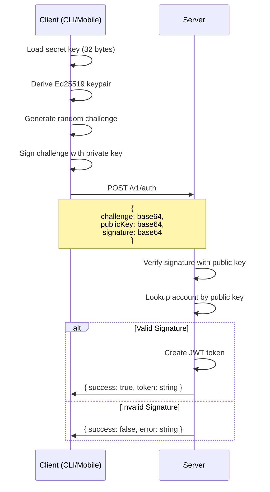
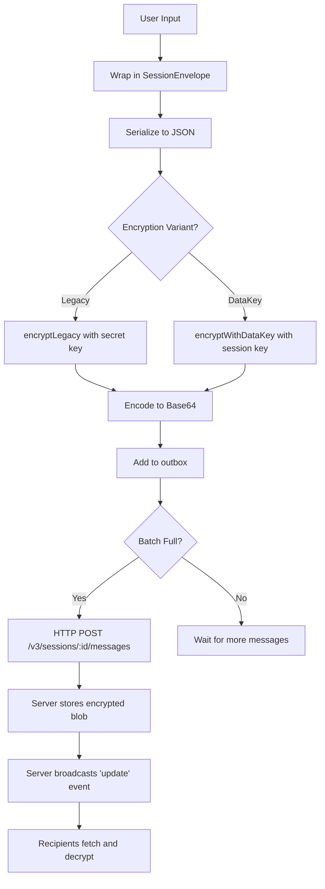
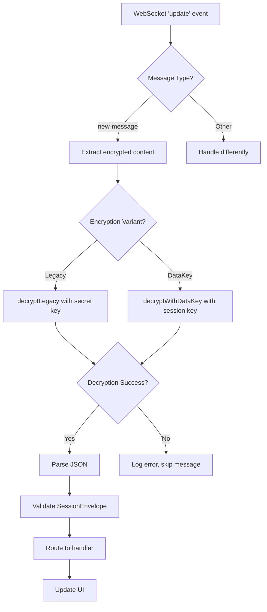

# Encryption Layer

Happy implements end-to-end encryption using TweetNaCl (NaCl/libsodium JavaScript port). All messages and sensitive data are encrypted on the client before transmission to the server.

<Warning>
The server **never** has access to unencrypted message content. All encryption/decryption happens exclusively on CLI and mobile clients.
</Warning>

## Cryptographic Primitives

### TweetNaCl Library

Happy uses the [tweetnacl](https://github.com/dchest/tweetnacl-js) library, a JavaScript port of Daniel J. Bernstein's NaCl cryptography library.

**Key Features**:
- **curve25519-xsalsa20-poly1305**: Public-key authenticated encryption
- **xsalsa20-poly1305**: Secret-key authenticated encryption
- **ed25519**: Digital signatures for authentication
- **sha512**: Hash function (via Node.js crypto)

**Implementation**: `packages/happy-cli/src/api/encryption.ts`

### Base64 Encoding

```typescript
// packages/happy-cli/src/api/encryption.ts:9
export function encodeBase64(buffer: Uint8Array, variant: 'base64' | 'base64url' = 'base64'): string {
  if (variant === 'base64url') {
    return encodeBase64Url(buffer);
  }
  return Buffer.from(buffer).toString('base64')
}

// Base64URL: URL-safe encoding (- instead of +, _ instead of /)
export function encodeBase64Url(buffer: Uint8Array): string {
  return Buffer.from(buffer)
    .toString('base64')
    .replaceAll('+', '-')
    .replaceAll('/', '_')
    .replaceAll('=', '')  // Remove padding
}
```

**Usage**:
- Standard base64: Message content, encryption keys
- Base64URL: QR codes, URL parameters (no escaping needed)

## Encryption Schemes

Happy supports two encryption variants:

<Tabs>
  <Tab title="Data Key (New)">
    **Algorithm**: AES-256-GCM + Box encryption
    
    **Features**:
    - Separate data encryption key per session
    - Key wrapped with user's public key
    - Server can verify ownership without decrypting
    - Forward secrecy support (future)
    
    **Format**:
    ```
    [version:1][nonce:12][ciphertext:N][authTag:16]
    ```
    
    **Implementation**: `packages/happy-cli/src/api/encryption.ts:120`
  </Tab>
  
  <Tab title="Legacy">
    **Algorithm**: XSalsa20-Poly1305 (secretbox)
    
    **Features**:
    - Simple symmetric encryption
    - Derived from user's secret key
    - Backward compatible
    
    **Format**:
    ```
    [nonce:24][ciphertext:N]
    ```
    
    **Implementation**: `packages/happy-cli/src/api/encryption.ts:87`
  </Tab>
</Tabs>

## Key Management

### Secret Key Generation

```typescript
// Generate 32-byte random secret key
export function getRandomBytes(size: number): Uint8Array {
  return new Uint8Array(randomBytes(size))  // Node.js crypto.randomBytes
}

const secretKey = getRandomBytes(32);
```

**Storage**: `~/.happy/access.key` (or `$HAPPY_HOME_DIR/access.key`)

**Permissions**: `0600` (read/write for owner only)

### Public Key Derivation

```typescript
// packages/happy-cli/src/api/encryption.ts:55
export function libsodiumPublicKeyFromSecretKey(seed: Uint8Array): Uint8Array {
  // Match libsodium implementation:
  // 1. Hash the seed with SHA-512
  const hashedSeed = new Uint8Array(createHash('sha512').update(seed).digest());
  
  // 2. Use first 32 bytes as secret key for curve25519
  const secretKey = hashedSeed.slice(0, 32);
  
  // 3. Derive public key from secret key
  return new Uint8Array(tweetnacl.box.keyPair.fromSecretKey(secretKey).publicKey);
}
```

**Why SHA-512?** Ensures compatibility with libsodium's key derivation (used by mobile app).

### Session Data Key

For new sessions using data key encryption:

```typescript
// packages/happy-cli/src/api/api.ts:43
if (this.credential.encryption.type === 'dataKey') {
  // 1. Generate fresh 32-byte AES key for this session
  encryptionKey = getRandomBytes(32);
  encryptionVariant = 'dataKey';
  
  // 2. Encrypt the data key with user's public key
  let encryptedDataKey = libsodiumEncryptForPublicKey(
    encryptionKey,
    this.credential.encryption.publicKey
  );
  
  // 3. Prepend version byte
  dataEncryptionKey = new Uint8Array(encryptedDataKey.length + 1);
  dataEncryptionKey.set([0], 0);  // Version 0
  dataEncryptionKey.set(encryptedDataKey, 1);
}
```

**Benefit**: Each session has unique encryption key, limiting damage if one key is compromised.

## Encryption Implementation

### Secret-Key Encryption (Legacy)

<Accordion title="Encrypt with secretbox">
```typescript
// packages/happy-cli/src/api/encryption.ts:87
export function encryptLegacy(data: any, secret: Uint8Array): Uint8Array {
  // 1. Generate random 24-byte nonce
  const nonce = getRandomBytes(tweetnacl.secretbox.nonceLength);  // 24
  
  // 2. Serialize data to JSON
  const plaintext = new TextEncoder().encode(JSON.stringify(data));
  
  // 3. Encrypt with XSalsa20-Poly1305
  const encrypted = tweetnacl.secretbox(plaintext, nonce, secret);
  
  // 4. Concatenate nonce + ciphertext
  const result = new Uint8Array(nonce.length + encrypted.length);
  result.set(nonce);
  result.set(encrypted, nonce.length);
  
  return result;
}
```

**Security Properties**:
- **Authenticated encryption**: Poly1305 MAC prevents tampering
- **Nonce**: Random, never reused (24-byte nonce space is huge)
- **Key**: 32-byte secret key (256-bit security)
</Accordion>

<Accordion title="Decrypt with secretbox">
```typescript
// packages/happy-cli/src/api/encryption.ts:102
export function decryptLegacy(data: Uint8Array, secret: Uint8Array): any | null {
  // 1. Extract nonce (first 24 bytes)
  const nonce = data.slice(0, tweetnacl.secretbox.nonceLength);
  
  // 2. Extract ciphertext (remaining bytes)
  const encrypted = data.slice(tweetnacl.secretbox.nonceLength);
  
  // 3. Decrypt with XSalsa20-Poly1305
  const decrypted = tweetnacl.secretbox.open(encrypted, nonce, secret);
  
  if (!decrypted) {
    // Authentication failed or wrong key
    return null;
  }
  
  // 4. Deserialize JSON
  return JSON.parse(new TextDecoder().decode(decrypted));
}
```

**Error Handling**: Returns `null` on decryption failure (wrong key or tampered data).
</Accordion>

### Data-Key Encryption (New)

<Accordion title="Encrypt with AES-256-GCM">
```typescript
// packages/happy-cli/src/api/encryption.ts:120
export function encryptWithDataKey(data: any, dataKey: Uint8Array): Uint8Array {
  // 1. Generate random 12-byte nonce (GCM standard)
  const nonce = getRandomBytes(12);
  
  // 2. Create AES-256-GCM cipher
  const cipher = createCipheriv('aes-256-gcm', dataKey, nonce);
  
  // 3. Serialize and encrypt data
  const plaintext = new TextEncoder().encode(JSON.stringify(data));
  const encrypted = Buffer.concat([
    cipher.update(plaintext),
    cipher.final()
  ]);
  
  // 4. Get authentication tag
  const authTag = cipher.getAuthTag();  // 16 bytes
  
  // 5. Bundle: version + nonce + ciphertext + tag
  const bundle = new Uint8Array(1 + 12 + encrypted.length + 16);
  bundle.set([0], 0);                           // Version byte
  bundle.set(nonce, 1);
  bundle.set(new Uint8Array(encrypted), 13);
  bundle.set(new Uint8Array(authTag), 13 + encrypted.length);
  
  return bundle;
}
```

**Why AES-GCM?**
- Hardware acceleration on modern CPUs (AES-NI)
- Industry standard (NIST approved)
- Built-in authentication (no separate MAC needed)
</Accordion>

<Accordion title="Decrypt with AES-256-GCM">
```typescript
// packages/happy-cli/src/api/encryption.ts:148
export function decryptWithDataKey(bundle: Uint8Array, dataKey: Uint8Array): any | null {
  // 1. Validate bundle size
  if (bundle.length < 1 + 12 + 16) {
    return null;  // Too small
  }
  
  // 2. Check version byte
  if (bundle[0] !== 0) {
    return null;  // Unsupported version
  }
  
  // 3. Extract components
  const nonce = bundle.slice(1, 13);
  const authTag = bundle.slice(bundle.length - 16);
  const ciphertext = bundle.slice(13, bundle.length - 16);
  
  try {
    // 4. Create decipher
    const decipher = createDecipheriv('aes-256-gcm', dataKey, nonce);
    decipher.setAuthTag(authTag);
    
    // 5. Decrypt
    const decrypted = Buffer.concat([
      decipher.update(ciphertext),
      decipher.final()
    ]);
    
    // 6. Deserialize JSON
    return JSON.parse(new TextDecoder().decode(decrypted));
  } catch (error) {
    // Decryption failed (wrong key, tampered data, etc.)
    return null;
  }
}
```

**Version Byte**: Allows future algorithm upgrades without breaking compatibility.
</Accordion>

### Public-Key Encryption (Box)

Used for wrapping data keys:

```typescript
// packages/happy-cli/src/api/encryption.ts:62
export function libsodiumEncryptForPublicKey(
  data: Uint8Array,
  recipientPublicKey: Uint8Array
): Uint8Array {
  // 1. Generate ephemeral keypair (one-time use)
  const ephemeralKeyPair = tweetnacl.box.keyPair();
  
  // 2. Generate random nonce
  const nonce = getRandomBytes(tweetnacl.box.nonceLength);  // 24 bytes
  
  // 3. Encrypt with curve25519-xsalsa20-poly1305
  const encrypted = tweetnacl.box(
    data,
    nonce,
    recipientPublicKey,
    ephemeralKeyPair.secretKey
  );
  
  // 4. Bundle: ephemeral public key + nonce + ciphertext
  const result = new Uint8Array(
    ephemeralKeyPair.publicKey.length +  // 32
    nonce.length +                        // 24
    encrypted.length
  );
  result.set(ephemeralKeyPair.publicKey, 0);
  result.set(nonce, 32);
  result.set(encrypted, 56);
  
  return result;
}
```

**Ephemeral Key**: Each encryption uses a fresh keypair, providing perfect forward secrecy.

## Authentication Flow

### Challenge-Response Protocol

```typescript
// packages/happy-cli/src/api/encryption.ts:199
export function authChallenge(secret: Uint8Array): {
  challenge: Uint8Array
  publicKey: Uint8Array
  signature: Uint8Array
} {
  // 1. Derive Ed25519 keypair from secret
  const keypair = tweetnacl.sign.keyPair.fromSeed(secret);
  
  // 2. Generate random challenge (32 bytes)
  const challenge = getRandomBytes(32);
  
  // 3. Sign the challenge with private key
  const signature = tweetnacl.sign.detached(challenge, keypair.secretKey);
  
  return {
    challenge,
    publicKey: keypair.publicKey,
    signature
  };
}
```

### Authentication Sequence



**Security**: 
- Secret key never transmitted
- Challenge is random (prevents replay attacks)
- Signature proves possession of secret key

**Implementation**: `packages/happy-cli/src/api/auth.ts:19`

## Message Encryption Flow

### Sending a Message



### Receiving a Message



## Security Properties

### Threat Model

<AccordionGroup>
  <Accordion title="Compromised Server">
  **Attack**: Server operator tries to read messages
  
  **Defense**: End-to-end encryption
  - Server only has encrypted blobs
  - Decryption keys never leave clients
  - Even database breach reveals no plaintext
  
  **Limitation**: Server can see metadata (who talks to whom, when)
  </Accordion>
  
  <Accordion title="Man-in-the-Middle">
  **Attack**: Attacker intercepts network traffic
  
  **Defense**: TLS + authenticated encryption
  - All HTTP/WebSocket traffic over TLS
  - NaCl authenticated encryption prevents tampering
  - Ed25519 signatures prevent impersonation
  
  **Limitation**: Requires trusted TLS certificate authority
  </Accordion>
  
  <Accordion title="Key Compromise">
  **Attack**: Attacker steals user's secret key
  
  **Current**: Full compromise of all sessions
  - Can decrypt all past and future messages
  - Can impersonate user
  
  **Mitigation (Future)**: 
  - Data key encryption limits to individual sessions
  - Key rotation would limit exposure
  - Perfect forward secrecy (ephemeral keys per message)
  </Accordion>
  
  <Accordion title="Replay Attacks">
  **Attack**: Attacker resends old messages
  
  **Defense**: Sequence numbers + nonces
  - Each message has unique sequence number
  - Encryption nonces are random (never reused)
  - Authentication challenge is random
  
  **Limitation**: Sequence numbers don't expire (no time-based revocation)
  </Accordion>
</AccordionGroup>

### Cryptographic Strength

<CardGroup cols={2}>
  <Card title="Secret-Key Encryption" icon="key">
    **Algorithm**: XSalsa20-Poly1305
    
    **Key Size**: 256 bits
    
    **Nonce Size**: 192 bits (24 bytes)
    
    **Authentication**: Poly1305 MAC (128-bit security)
    
    **Status**: Industry standard, NaCl recommendation
  </Card>
  
  <Card title="Data-Key Encryption" icon="shield">
    **Algorithm**: AES-256-GCM
    
    **Key Size**: 256 bits
    
    **Nonce Size**: 96 bits (12 bytes)
    
    **Authentication**: GCM (128-bit security)
    
    **Status**: NIST approved, hardware accelerated
  </Card>
  
  <Card title="Public-Key Encryption" icon="lock">
    **Algorithm**: Curve25519 (Box)
    
    **Key Size**: 256 bits
    
    **Security Level**: ~128-bit (elliptic curve)
    
    **Status**: Modern standard, resistance to side-channels
  </Card>
  
  <Card title="Digital Signatures" icon="signature">
    **Algorithm**: Ed25519
    
    **Key Size**: 256 bits
    
    **Signature Size**: 512 bits (64 bytes)
    
    **Status**: Fast, secure, deterministic
  </Card>
</CardGroup>

### Best Practices

<Warning>
**DO**:
- Use fresh nonces for every encryption
- Store secret keys with `0600` permissions
- Validate all decrypted data (schema checks)
- Log decryption failures for debugging
- Use constant-time comparison for MACs (automatic in NaCl)

**DON'T**:
- Reuse nonces (breaks encryption security)
- Store secret keys in plaintext in cloud storage
- Ignore decryption failures silently
- Log decrypted data (leaks secrets)
- Roll your own crypto primitives
</Warning>

## Future Improvements

<Accordion title="Perfect Forward Secrecy">
**Current**: Session key reused for entire session

**Proposal**: Use ephemeral keys per message
1. Generate fresh keypair for each message
2. Encrypt message with ephemeral key
3. Wrap ephemeral key with recipient's public key
4. Delete ephemeral private key immediately

**Benefit**: Compromise of long-term key doesn't reveal past messages
</Accordion>

<Accordion title="Key Rotation">
**Current**: Secret key never changes

**Proposal**: Support key rotation
1. Generate new secret key
2. Re-encrypt all sessions with new key
3. Upload encrypted transition proof
4. Clients verify transition

**Benefit**: Limit damage from key compromise
</Accordion>

<Accordion title="Multi-Device Sync">
**Current**: Same secret key on all devices

**Proposal**: Device-specific keys
1. Each device has unique keypair
2. Session keys encrypted for all device keys
3. Revoke individual devices

**Benefit**: Stolen device doesn't compromise other devices
</Accordion>

<Accordion title="Post-Quantum Cryptography">
**Current**: Elliptic curve crypto (vulnerable to quantum computers)

**Proposal**: Hybrid encryption
1. Use both classical and post-quantum algorithms
2. Encrypt with both (Belt-and-suspenders)
3. Require breaking both to compromise

**Timeline**: When NIST PQC standards stabilize
</Accordion>

## Testing Encryption

### Unit Tests

```bash
cd packages/happy-cli
yarn test src/api/encryption.test.ts
```

**Coverage**:
- Round-trip encryption/decryption
- Base64 encoding variants
- Key derivation
- Authentication challenge

### Integration Tests

```bash
cd packages/happy-agent
yarn test src/encryption.test.ts
```

**Coverage**:
- Cross-platform compatibility (Node.js ↔ React Native)
- Legacy format support
- Version byte handling

## Debugging Encryption Issues

<Steps>
  <Step title="Verify Key Loading">
    Check that secret key is loaded correctly:
    ```bash
    # CLI
    cat ~/.happy/access.key | base64
    
    # Should be 43-44 characters (32 bytes base64-encoded)
    ```
  </Step>
  
  <Step title="Check Encryption Variant">
    Look for `encryptionVariant` in logs:
    ```
    [DEBUG] Session created with encryptionVariant: dataKey
    ```
  </Step>
  
  <Step title="Inspect Encrypted Payload">
    Encrypted messages are base64 strings:
    ```typescript
    // Too short = encryption failed
    if (encryptedContent.length < 50) {
      console.error('Encryption produced invalid output');
    }
    ```
  </Step>
  
  <Step title="Test Decryption Locally">
    Manually decrypt a message:
    ```typescript
    import { decrypt, decodeBase64 } from './encryption';
    
    const key = loadSecretKey();
    const encrypted = decodeBase64(message.content.c);
    const plaintext = decrypt(key, 'dataKey', encrypted);
    
    if (!plaintext) {
      console.error('Decryption failed - wrong key or corrupted data');
    }
    ```
  </Step>
</Steps>

## Reference Implementation

The encryption layer is implemented in a single file:

**Location**: `packages/happy-cli/src/api/encryption.ts`

**Exports**:
- `encodeBase64()` / `decodeBase64()` - Base64 encoding (line 9, 34)
- `getRandomBytes()` - Secure random generation (line 51)
- `libsodiumPublicKeyFromSecretKey()` - Public key derivation (line 55)
- `libsodiumEncryptForPublicKey()` - Box encryption (line 62)
- `encryptLegacy()` / `decryptLegacy()` - Legacy encryption (line 87, 102)
- `encryptWithDataKey()` / `decryptWithDataKey()` - Data key encryption (line 120, 148)
- `authChallenge()` - Authentication signature (line 199)

## Next Steps

<CardGroup cols={2}>
  <Card title="Data Flow" href="/development/data-flow" icon="diagram-project">
    See how encrypted messages flow through the system
  </Card>
  
  <Card title="Session Lifecycle" href="/development/session-lifecycle" icon="circle-nodes">
    Learn when keys are generated and used
  </Card>
  
  <Card title="Authentication Guide" href="/guides/authentication" icon="key">
    Learn about secure authentication
  </Card>
  
  <Card title="Architecture" href="/development/architecture" icon="sitemap">
    Understand overall system design
  </Card>
</CardGroup>