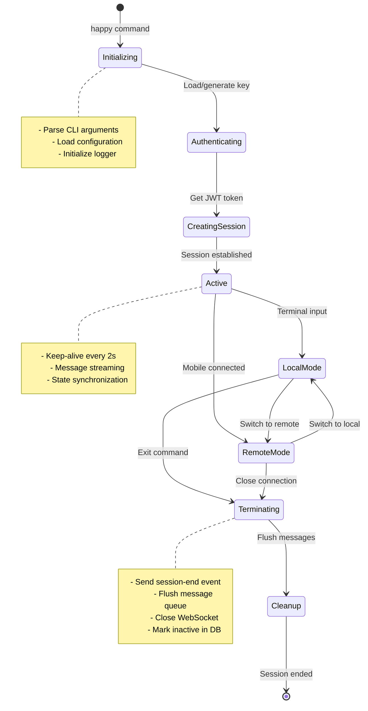
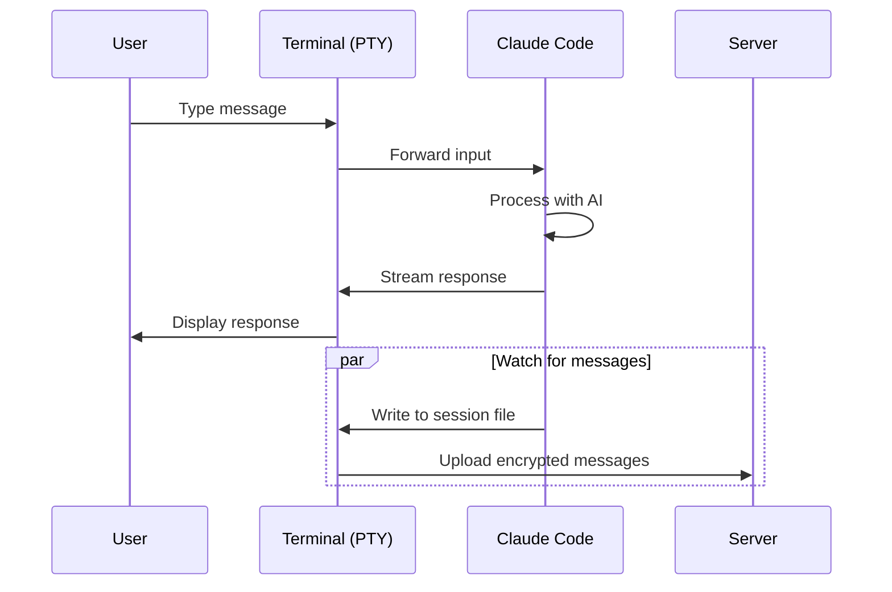
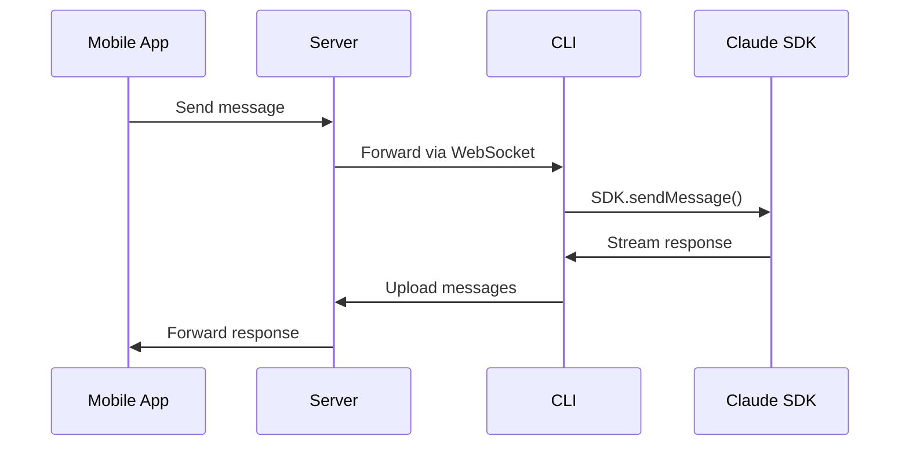
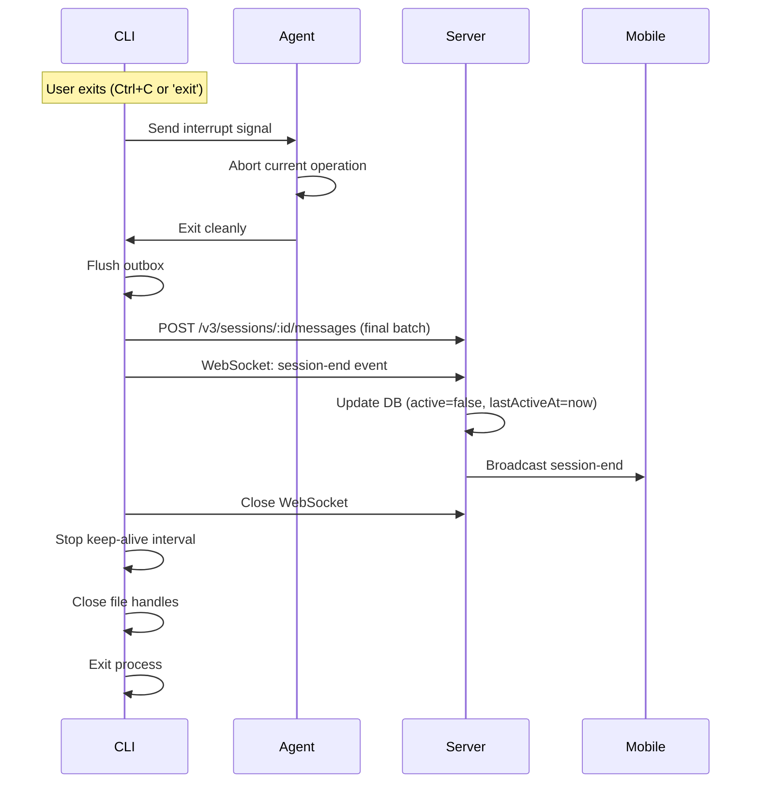

# Session Lifecycle

A session in Happy represents a single AI agent conversation. This document explains the complete lifecycle from creation to termination.

## Overview



## Session Creation

### 1. CLI Initialization

```typescript
// packages/happy-cli/src/index.ts
import { program } from 'commander';
import { start } from '@/ui/start';

// Parse command-line arguments
program
  .option('-m, --model <model>', 'Claude model')
  .option('-p, --permission-mode <mode>', 'Permission mode')
  .parse();

const options = program.opts();

// Start session
await start({
  path: process.cwd(),
  model: options.model,
  permissionMode: options.permissionMode,
  // ...
});
```

**Steps**:
1. Parse CLI arguments (model, permissions, etc.)
2. Load configuration from environment variables
3. Initialize file-based logger
4. Determine working directory

### 2. Authentication

<Steps>
  <Step title="Load or Generate Secret Key">
    ```typescript
    // packages/happy-cli/src/persistence.ts
    export async function readPrivateKey(): Promise<Uint8Array> {
      const keyPath = path.join(getHomeDir(), 'access.key');
      
      if (!existsSync(keyPath)) {
        // Generate new 32-byte secret key
        const key = getRandomBytes(32);
        await writePrivateKey(key);
        return key;
      }
      
      // Load existing key
      const base64 = await readFile(keyPath, 'utf-8');
      return decodeBase64(base64.trim());
    }
    ```
    
    **Location**: `~/.happy/access.key` (production) or `~/.happy-dev/access.key` (development)
  </Step>
  
  <Step title="Generate Challenge Signature">
    ```typescript
    // packages/happy-cli/src/api/auth.ts:19
    export async function authGetToken(secret: Uint8Array): Promise<string> {
      // Create Ed25519 signature
      const { challenge, publicKey, signature } = authChallenge(secret);
      
      // Send to server
      const response = await axios.post(`/v1/auth`, {
        challenge: encodeBase64(challenge),
        publicKey: encodeBase64(publicKey),
        signature: encodeBase64(signature)
      });
      
      return response.data.token;  // JWT token
    }
    ```
    
    **Security**: Challenge is random, signature proves key possession without transmitting it.
  </Step>
  
  <Step title="Receive JWT Token">
    Server validates signature and returns JWT:
    ```json
    {
      "success": true,
      "token": "eyJhbGciOiJIUzI1NiIsInR5cCI6IkpXVCJ9..."
    }
    ```
    
    **Token Contents**:
    - User ID (account ID in database)
    - Expiration (typically 30 days)
    - Signature (HMAC with server secret)
  </Step>
</Steps>

### 3. Session Registration

```typescript
// packages/happy-cli/src/api/api.ts:30
async getOrCreateSession(opts: {
  tag: string,
  metadata: Metadata,
  state: AgentState | null
}): Promise<Session | null> {
  // 1. Generate encryption key
  let encryptionKey: Uint8Array;
  if (this.credential.encryption.type === 'dataKey') {
    encryptionKey = getRandomBytes(32);  // Fresh key per session
  } else {
    encryptionKey = this.credential.encryption.secret;  // Derived from user key
  }
  
  // 2. Encrypt metadata and state
  const encryptedMetadata = encrypt(encryptionKey, opts.metadata);
  const encryptedState = opts.state ? encrypt(encryptionKey, opts.state) : null;
  
  // 3. POST to server
  const response = await axios.post('/v1/sessions', {
    tag: opts.tag,  // Deduplication key
    metadata: encodeBase64(encryptedMetadata),
    agentState: encryptedState ? encodeBase64(encryptedState) : null,
    dataEncryptionKey: /* wrapped key if using dataKey mode */
  });
  
  // 4. Return decrypted session object
  return {
    id: response.data.session.id,
    encryptionKey,
    metadata: opts.metadata,
    agentState: opts.state,
    // ...
  };
}
```

**Tag-Based Deduplication**: If a session with the same tag exists, server returns it instead of creating a new one.

**Metadata Contents**:
```typescript
type Metadata = {
  path: string              // Working directory (e.g., '/home/user/project')
  hostname: string          // Machine hostname
  username: string          // System username
  tag: string              // Session tag
  summary?: {
    text: string           // Latest conversation summary
    updatedAt: number
  }
  claudeSessionId?: string // Claude Code session UUID (set later)
}
```

### 4. WebSocket Connection

```typescript
// packages/happy-cli/src/api/apiSession.ts:131
this.socket = io(serverUrl, {
  auth: {
    token: this.token,
    clientType: 'session-scoped',
    sessionId: this.sessionId
  },
  path: '/v1/updates',
  reconnection: true,
  reconnectionAttempts: Infinity,
  reconnectionDelay: 1000,
  reconnectionDelayMax: 5000,
  transports: ['websocket'],
  autoConnect: false
});

// Set up event handlers
this.socket.on('connect', () => {
  logger.debug('Socket connected');
  this.receiveSync.invalidate();  // Fetch missed messages
});

this.socket.on('update', (data) => {
  // Handle incoming messages
});

this.socket.connect();
```

**Connection Type**: `session-scoped` means this connection only receives updates for the specific session.

### 5. Display QR Code

CLI displays QR code for mobile connection:

```typescript
// packages/happy-cli/src/ui/qrcode.ts
export function generateAppUrl(secret: Uint8Array): string {
  const secretBase64Url = encodeBase64Url(secret);
  return `handy://${secretBase64Url}`;
}

const url = generateAppUrl(secretKey);
qrcode.generate(url, { small: true });

console.log('Scan this QR code with the Happy app');
```

**URL Format**: `handy://[base64url-encoded-secret-key]`

**Security**: Secret key embedded in URL, but QR code only shown on trusted terminal.

## Session Modes

### Local Mode (Interactive)

User interacts directly with Claude in terminal:



**Implementation**: `packages/happy-cli/src/claude/claudeLocalLauncher.ts`

**Features**:
- Direct terminal interaction
- Full color output
- Real-time streaming
- File watching to capture messages

### Remote Mode

Mobile app sends messages, CLI forwards to Claude:



**Implementation**: `packages/happy-cli/src/claude/claudeRemoteLauncher.ts`

**Features**:
- Non-interactive (no terminal required)
- Runs in background
- Full agent capabilities
- Real-time progress updates

### Mode Switching

```typescript
// packages/happy-cli/src/claude/loop.ts:47
export async function loop(opts: LoopOptions): Promise<number> {
  let mode: 'local' | 'remote' = opts.startingMode ?? 'local';
  
  while (true) {
    switch (mode) {
      case 'local': {
        const result = await claudeLocalLauncher(session);
        if (result.type === 'switch') {
          mode = 'remote';
          opts.onModeChange(mode);
        } else if (result.type === 'exit') {
          return result.code;
        }
        break;
      }
      
      case 'remote': {
        const reason = await claudeRemoteLauncher(session);
        if (reason === 'switch') {
          mode = 'local';
          opts.onModeChange(mode);
        } else if (reason === 'exit') {
          return 0;
        }
        break;
      }
    }
  }
}
```

**Trigger**: User types special command (e.g., `/remote`) or mobile app requests switch.

## Keep-Alive Mechanism

### Periodic Pings

```typescript
// packages/happy-cli/src/claude/session.ts:69
this.client.keepAlive(this.thinking, this.mode);
this.keepAliveInterval = setInterval(() => {
  this.client.keepAlive(this.thinking, this.mode);
}, 2000);  // Every 2 seconds
```

### Server Handling

```typescript
// packages/happy-server/sources/app/api/socket/sessionUpdateHandler.ts:139
socket.on('session-alive', async (data) => {
  const { sid, time, thinking } = data;
  
  // Validate session ownership
  const isValid = await activityCache.isSessionValid(sid, userId);
  if (!isValid) return;
  
  // Queue database update (debounced)
  activityCache.queueSessionUpdate(sid, time);
  
  // Broadcast to mobile (real-time presence)
  eventRouter.emitEphemeral({
    userId,
    payload: buildSessionActivityEphemeral(sid, true, time, thinking),
    recipientFilter: { type: 'user-scoped-only' }
  });
});
```

**Purpose**:
- Show "Active" badge in mobile app
- Prevent session timeout
- Display thinking indicator

**Database Updates**: Debounced to avoid excessive writes (only update if >5 seconds since last update).

## Message Synchronization

### Outbox Pattern

CLI batches outgoing messages:

```typescript
// packages/happy-cli/src/api/apiSession.ts:337
private enqueueMessage(content: unknown) {
  const encrypted = encodeBase64(encrypt(this.encryptionKey, content));
  this.pendingOutbox.push({
    content: encrypted,
    localId: randomUUID()
  });
  this.sendSync.invalidate();  // Trigger flush
}

private async flushOutbox() {
  if (this.pendingOutbox.length === 0) return;
  
  const batch = this.pendingOutbox.slice();
  const response = await axios.post(
    `/v3/sessions/${this.sessionId}/messages`,
    { messages: batch }
  );
  
  this.pendingOutbox.splice(0, batch.length);
}
```

**Benefits**:
- Reduces HTTP requests
- Preserves message order
- Automatic retry on failure

### Inbox Sync

CLI fetches missed messages on reconnect:

```typescript
// packages/happy-cli/src/api/apiSession.ts:256
private async fetchMessages() {
  let afterSeq = this.lastSeq;
  
  while (true) {
    const response = await axios.get(
      `/v3/sessions/${sessionId}/messages`,
      { params: { after_seq: afterSeq, limit: 100 } }
    );
    
    for (const message of response.data.messages) {
      const body = decrypt(this.encryptionKey, message.content.c);
      this.routeIncomingMessage(body);
      this.lastSeq = Math.max(this.lastSeq, message.seq);
    }
    
    if (!response.data.hasMore) break;
    afterSeq = maxSeq;
  }
}
```

**Trigger**: WebSocket reconnect or sequence gap detected.

## Claude Session Tracking

### Session ID Discovery

Claude Code generates a session UUID that must be tracked:

```typescript
// packages/happy-cli/src/claude/session.ts:106
onSessionFound(sessionId: string) {
  this.sessionId = sessionId;
  
  // Update metadata with Claude session ID
  this.client.updateMetadata((metadata) => ({
    ...metadata,
    claudeSessionId: sessionId
  }));
  
  logger.debug(`Claude session ID ${sessionId} added to metadata`);
  
  // Notify callbacks (e.g., SessionScanner)
  for (const callback of this.sessionFoundCallbacks) {
    callback(sessionId);
  }
}
```

**How It's Detected**:
1. Claude Code emits `SessionStart` hook event
2. Hook writes to temporary settings file
3. CLI reads file and extracts session ID

**Why Track It?**:
- Resume sessions with `--resume <id>` flag
- Scan session history files
- Associate messages with Claude's internal state

### Session Resumption

User can resume previous Claude session:

```bash
happy --resume 1433467f-ff14-4292-b5b2-2aac77a808f0
```

**Implementation**:
```typescript
// packages/happy-cli/src/claude/session.ts:151
consumeOneTimeFlags() {
  // Remove --resume and --continue after first use
  const filteredArgs = this.claudeArgs.filter((arg, i) => {
    if (arg === '--continue') return false;
    if (arg === '--resume') {
      // Also skip next arg if it's a UUID
      if (this.claudeArgs[i + 1]?.includes('-')) {
        this.claudeArgs.splice(i + 1, 1);
      }
      return false;
    }
    return true;
  });
  this.claudeArgs = filteredArgs;
}
```

**Note**: `--resume` creates a NEW Claude session with history copied. See CLAUDE.md in happy-cli for details.

## State Management

### Metadata Updates

<Accordion title="Optimistic Concurrency Control">
```typescript
// packages/happy-cli/src/api/apiSession.ts:528
updateMetadata(handler: (metadata: Metadata) => Metadata) {
  this.metadataLock.inLock(async () => {
    await backoff(async () => {
      let updated = handler(this.metadata);
      
      const answer = await this.socket.emitWithAck('update-metadata', {
        sid: this.sessionId,
        expectedVersion: this.metadataVersion,
        metadata: encodeBase64(encrypt(this.encryptionKey, updated))
      });
      
      if (answer.result === 'success') {
        this.metadata = updated;
        this.metadataVersion = answer.version;
      } else if (answer.result === 'version-mismatch') {
        // Retry with new version
        this.metadata = decrypt(this.encryptionKey, answer.metadata);
        this.metadataVersion = answer.version;
        throw new Error('Metadata version mismatch');
      }
    });
  });
}
```

**Locking**: Prevents concurrent updates from same client.

**Backoff**: Retries with exponential backoff on version conflict.
</Accordion>

### Agent State Updates

Similar to metadata, but for agent-specific state:

```typescript
updateAgentState(handler: (state: AgentState) => AgentState) {
  // Same pattern as updateMetadata
}
```

**Use Case**: Store conversation history, tool results, etc.

## Session Termination

### Graceful Shutdown



**Implementation**: `packages/happy-cli/src/claude/session.ts:78` (cleanup method)

### Force Kill

If user kills CLI (SIGKILL), session remains "active" in database:

**Server Behavior**:
- Keep-alive stops arriving
- After 60 seconds, mark session as inactive
- Mobile app shows "Last active: 1 minute ago"

**Recovery**:
- User can restart CLI
- Session resumes with same ID (tag-based lookup)
- Message history preserved

### Session Expiration

Sessions persist indefinitely, but can be manually deleted:

```bash
# Future: happy session delete <tag>
```

**Database**: Old sessions archived after 30 days (not yet implemented).

## Error Recovery

<AccordionGroup>
  <Accordion title="Network Disconnect">
  **Scenario**: WiFi drops during session
  
  **CLI Behavior**:
  1. WebSocket disconnect detected
  2. Messages queued in outbox
  3. Automatic reconnection (exponential backoff)
  4. Fetch missed messages
  5. Resume normal operation
  
  **User Impact**: None (if reconnect within 60s)
  </Accordion>
  
  <Accordion title="Server Restart">
  **Scenario**: Server deploys new version
  
  **CLI Behavior**:
  1. All WebSocket connections close
  2. Clients reconnect automatically
  3. Session state loaded from database
  4. No messages lost (persisted before restart)
  
  **User Impact**: Brief "Connecting..." indicator
  </Accordion>
  
  <Accordion title="CLI Crash">
  **Scenario**: CLI process killed (OOM, segfault)
  
  **Recovery**:
  1. User restarts CLI
  2. Existing session found by tag
  3. Message history fetched from server
  4. Claude session resumed (if using --resume)
  
  **Data Loss**: None (all messages persisted)
  </Accordion>
  
  <Accordion title="Encryption Key Mismatch">
  **Scenario**: User changes secret key between devices
  
  **Result**: Decryption failures
  
  **Resolution**:
  1. Sync secret key across devices (manual)
  2. Or create new sessions per device
  
  **Future**: Multi-device key management
  </Accordion>
</AccordionGroup>

## Performance Monitoring

### Usage Tracking

CLI reports token usage after each response:

```typescript
// packages/happy-cli/src/api/apiSession.ts:497
sendUsageData(usage: Usage, model?: string) {
  const totalTokens = 
    usage.input_tokens + 
    usage.output_tokens + 
    (usage.cache_creation_input_tokens || 0) + 
    (usage.cache_read_input_tokens || 0);
  
  const costs = calculateCost(usage, model);
  
  this.socket.emit('usage-report', {
    key: 'claude-session',
    sessionId: this.sessionId,
    tokens: {
      total: totalTokens,
      input: usage.input_tokens,
      output: usage.output_tokens,
      cache_creation: usage.cache_creation_input_tokens || 0,
      cache_read: usage.cache_read_input_tokens || 0
    },
    cost: {
      total: costs.total,
      input: costs.input,
      output: costs.output
    }
  });
}
```

**Server**: Aggregates usage per user for billing/analytics.

### Session Metrics

**Tracked**:
- Message count
- Total tokens used
- Session duration
- Last active timestamp
- Mode switches (local ↔ remote)

**Future**: Prometheus metrics export for monitoring.

## Best Practices

<Warning>
**DO**:
- Use meaningful session tags (e.g., project name)
- Exit gracefully (don't force kill)
- Keep CLI updated (encryption format changes)
- Sync secret key across devices securely

**DON'T**:
- Share secret key in plaintext
- Run multiple CLIs with same session tag
- Ignore decryption errors (investigate cause)
- Delete session files manually (use CLI commands)
</Warning>

## Debugging Session Issues

<Steps>
  <Step title="Check Session ID">
    ```bash
    # Look for session ID in logs
    grep "Session created" ~/.happy-dev/logs/*.log
    ```
  </Step>
  
  <Step title="Verify WebSocket Connection">
    ```bash
    # Check for connect/disconnect events
    grep "Socket connected\|Socket disconnected" ~/.happy-dev/logs/*.log
    ```
  </Step>
  
  <Step title="Inspect Keep-Alive">
    ```bash
    # Should see pings every 2 seconds
    grep "session-alive" ~/.happy-dev/logs/*.log | tail
    ```
  </Step>
  
  <Step title="Check Message Sync">
    ```bash
    # Look for sequence gaps
    grep "version-mismatch\|Fetching messages" ~/.happy-dev/logs/*.log
    ```
  </Step>
</Steps>

## Next Steps

<CardGroup cols={2}>
  <Card title="Data Flow" href="/development/data-flow" icon="diagram-project">
    Understand message routing in detail
  </Card>
  
  <Card title="Encryption Layer" href="/development/encryption-layer" icon="lock">
    Learn how session data is protected
  </Card>
  
  <Card title="Architecture" href="/development/architecture" icon="sitemap">
    High-level system overview
  </Card>
  
  <Card title="Session Management" href="/guides/session-management" icon="terminal">
    Learn about session management
  </Card>
</CardGroup>