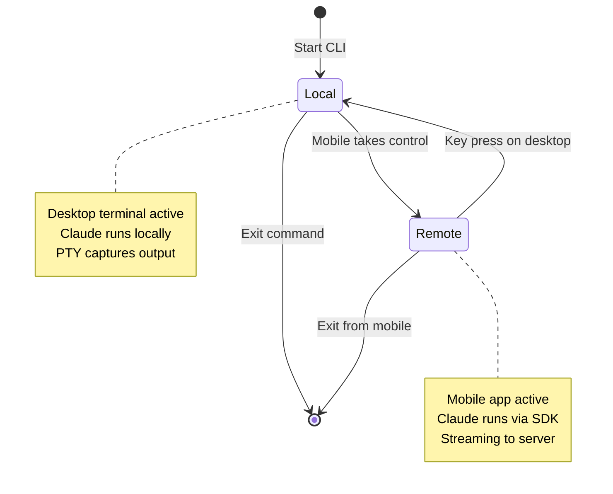

Happy's device switching feature lets you transition control of your Claude Code sessions between your computer and mobile device with a single keypress. Start coding on your desktop, then take control from your phone, or switch back whenever you need.

## How It Works

Device switching is built into Happy's core architecture. The CLI runs a control loop that alternates between **local mode** (desktop) and **remote mode** (mobile) based on input signals.

### Mode Architecture



## Control Loop Implementation

The core control loop manages mode switching:

```typescript
// From packages/happy-cli/src/claude/loop.ts
export async function loop(opts: LoopOptions): Promise<number> {
  let session = new Session({
    api: opts.api,
    client: opts.session,
    path: opts.path,
    sessionId: null,
    // ... other config
  });

  let mode: 'local' | 'remote' = opts.startingMode ?? 'local';
  
  while (true) {
    logger.debug(`[loop] Iteration with mode: ${mode}`);

    switch (mode) {
      case 'local': {
        const result = await claudeLocalLauncher(session);
        switch (result.type) {
          case 'switch':
            mode = 'remote';
            opts.onModeChange?.(mode);
            break;
          case 'exit':
            return result.code;
        }
        break;
      }

      case 'remote': {
        const reason = await claudeRemoteLauncher(session);
        switch (reason) {
          case 'exit':
            return 0;
          case 'switch':
            mode = 'local';
            opts.onModeChange?.(mode);
            break;
        }
        break;
      }
    }
  }
}
```

## Session State Management

The `Session` class maintains state across mode transitions:

```typescript
// From packages/happy-cli/src/claude/session.ts
export class Session {
  sessionId: string | null;
  mode: 'local' | 'remote' = 'local';
  thinking: boolean = false;
  
  private keepAliveInterval: NodeJS.Timeout;

  constructor(opts: SessionOptions) {
    this.path = opts.path;
    this.sessionId = opts.sessionId;
    this.queue = opts.messageQueue;
    
    // Start keep alive heartbeat
    this.client.keepAlive(this.thinking, this.mode);
    this.keepAliveInterval = setInterval(() => {
      this.client.keepAlive(this.thinking, this.mode);
    }, 2000);
  }
  
  onModeChange = (mode: 'local' | 'remote') => {
    this.mode = mode;
    this.client.keepAlive(this.thinking, mode);
    this._onModeChange(mode);
  }
}
```

## Switching Triggers

### From Local to Remote

Switch to mobile control when:
- User presses a special key sequence in the mobile app
- CLI receives remote control request via WebSocket
- Mobile app sends "take control" command

### From Remote to Local

Switch back to desktop when:
- **Any key press** on the desktop keyboard
- User explicitly releases control from mobile
- Connection timeout or error

<Note>
  Pressing any key on your keyboard while in remote mode instantly switches back to local mode. This makes reclaiming control intuitive and fast.
</Note>

## Permission Modes

Each mode can have different permission settings:

```typescript
export type PermissionMode = 
  | 'ask'              // Ask for every permission
  | 'enabled'          // Allow all permissions
  | 'disabled'         // Deny all permissions
  | 'ask-file-write'   // Ask only for file write permissions
  | 'ask-bash'         // Ask only for bash command permissions
  | 'ask-file-write-bash' // Ask for file write and bash
  | 'ask-tool-use';    // Ask for tool usage permissions

export interface EnhancedMode {
  permissionMode: PermissionMode;
  model?: string;
  fallbackModel?: string;
  customSystemPrompt?: string;
  appendSystemPrompt?: string;
  allowedTools?: string[];
  disallowedTools?: string[];
}
```

## Local Mode Details

### Local Launcher

In local mode, Claude runs as a spawned process:

```typescript
// Conceptual flow of local launcher
export async function claudeLocalLauncher(session: Session) {
  // Spawn Claude process with PTY
  const claudeProcess = spawn('claude', args, {
    cwd: session.path,
    env: session.claudeEnvVars,
    // PTY for interactive terminal
  });
  
  // Watch for output and sync to server
  claudeProcess.on('data', (data) => {
    // Send output to server for mobile viewing
    session.client.sendUpdate(data);
  });
  
  // Listen for mode switch request
  session.client.on('switch-mode', () => {
    // Clean shutdown of local process
    claudeProcess.kill();
    return { type: 'switch' };
  });
  
  // Wait for completion or switch
  await claudeProcess.wait();
  
  return { type: 'exit', code: 0 };
}
```

### File Watching

Local mode includes a file watcher that monitors Claude's session files:

```typescript
// Watches ~/.claude/projects/*/session-id.jsonl
const watcher = new SessionFileWatcher({
  sessionId: session.sessionId,
  onMessage: (message) => {
    // Stream messages to mobile app
    session.client.sendMessage(message);
  }
});
```

## Remote Mode Details

### Remote Launcher

In remote mode, Claude runs via the SDK:

```typescript
// Conceptual flow of remote launcher
export async function claudeRemoteLauncher(session: Session) {
  // Use Claude SDK instead of spawning process
  const claudeSdk = new ClaudeSDK({
    apiKey: process.env.ANTHROPIC_API_KEY,
    model: session.model,
    // ... other config
  });
  
  // Process messages from mobile app
  for await (const message of session.queue) {
    const response = await claudeSdk.sendMessage(message);
    
    // Stream response back to mobile
    for await (const chunk of response) {
      session.client.sendUpdate(chunk);
    }
  }
  
  // Listen for mode switch (keyboard input)
  if (detectKeyPress()) {
    return 'switch';
  }
  
  return 'exit';
}
```

### SDK Integration

Remote mode uses the official Claude Code SDK:

```typescript
import { ClaudeCode } from '@anthropic-ai/claude-code';

const sdk = new ClaudeCode({
  apiKey: process.env.ANTHROPIC_API_KEY,
  workingDirectory: session.path,
  mcpServers: session.mcpServers,
});
```

## Keep-Alive Mechanism

The session maintains a heartbeat to inform the server of current state:

```typescript
// Keep-alive sent every 2 seconds
setInterval(() => {
  session.client.keepAlive(
    thinking,  // Is Claude currently processing?
    mode       // 'local' or 'remote'
  );
}, 2000);
```

This allows the mobile app to display real-time status:
- Active mode (local/remote)
- Whether Claude is thinking or idle
- Connection health

## Session Continuity

Switching modes preserves session state:

<Steps>
  <Step title="Session ID tracking">
    The same Claude session ID is maintained across mode switches
  </Step>
  <Step title="Context preservation">
    Conversation history and file context remain intact
  </Step>
  <Step title="Resume capability">
    Sessions can be resumed with `--resume` flag after reconnection
  </Step>
  <Step title="Message queue">
    Pending messages are queued and processed after mode switch
  </Step>
</Steps>

## Mobile App Integration

The mobile app displays mode status and provides controls:

```typescript
// Mobile app shows current mode
const SessionView = ({ session }) => {
  const mode = session.metadata?.mode; // 'local' or 'remote'
  const thinking = session.metadata?.thinking; // boolean
  
  return (
    <View>
      <Text>Mode: {mode === 'local' ? 'Desktop' : 'Mobile'}</Text>
      <Text>Status: {thinking ? 'Thinking...' : 'Ready'}</Text>
      
      {mode === 'local' && (
        <Button onPress={requestControl}>
          Take Control
        </Button>
      )}
      
      {mode === 'remote' && (
        <Button onPress={releaseControl}>
          Release Control
        </Button>
      )}
    </View>
  );
};
```

## Performance Considerations

### Local Mode Benefits
- Lower latency (no server round-trip)
- Reduced API costs (direct terminal access)
- Full terminal features (colors, formatting)

### Remote Mode Benefits
- Mobile control and input
- Access from anywhere
- No need for desktop keyboard

## Troubleshooting

<AccordionGroup>
  <Accordion title="Mode doesn't switch on key press">
    Ensure your terminal has focus and the CLI is in remote mode. The switch trigger requires an actual key press to be detected by stdin.
  </Accordion>
  
  <Accordion title="Session state lost on switch">
    Check that the session ID is properly tracked. Look for `onSessionFound` calls in the logs. The CLI uses a SessionStart hook to track session IDs.
  </Accordion>
  
  <Accordion title="Mobile shows 'disconnected' during switch">
    This is normal during the transition. The keep-alive heartbeat may briefly stop. Wait 2-3 seconds for the new mode to establish.
  </Accordion>
  
  <Accordion title="Cannot take control from mobile">
    Verify the CLI is running and in local mode. Check network connectivity between the mobile app and Happy server.
  </Accordion>
</AccordionGroup>

## Advanced Configuration

### Starting Mode

Specify the initial mode when starting Happy:

```bash
# Start in remote mode (mobile control)
happy --remote

# Start in local mode (default)
happy
```

### Custom Mode Behavior

Configure mode-specific settings:

```typescript
const modeConfig: EnhancedMode = {
  permissionMode: 'ask-file-write-bash',
  model: 'claude-opus-4',
  allowedTools: ['read_file', 'list_files'],
  customSystemPrompt: 'You are a helpful coding assistant.'
};
```

## Next Steps

<CardGroup cols={2}>
  <Card title="Mobile Access" icon="mobile" href="/features/mobile-access">
    Learn about the mobile apps
  </Card>
  <Card title="CLI Reference" icon="terminal" href="/cli/commands">
    Explore CLI commands and options
  </Card>
  <Card title="Push Notifications" icon="bell" href="/features/push-notifications">
    Get notified during mode switches
  </Card>
  <Card title="Voice Control" icon="microphone" href="/features/voice-control">
    Use voice commands in remote mode
  </Card>
</CardGroup>