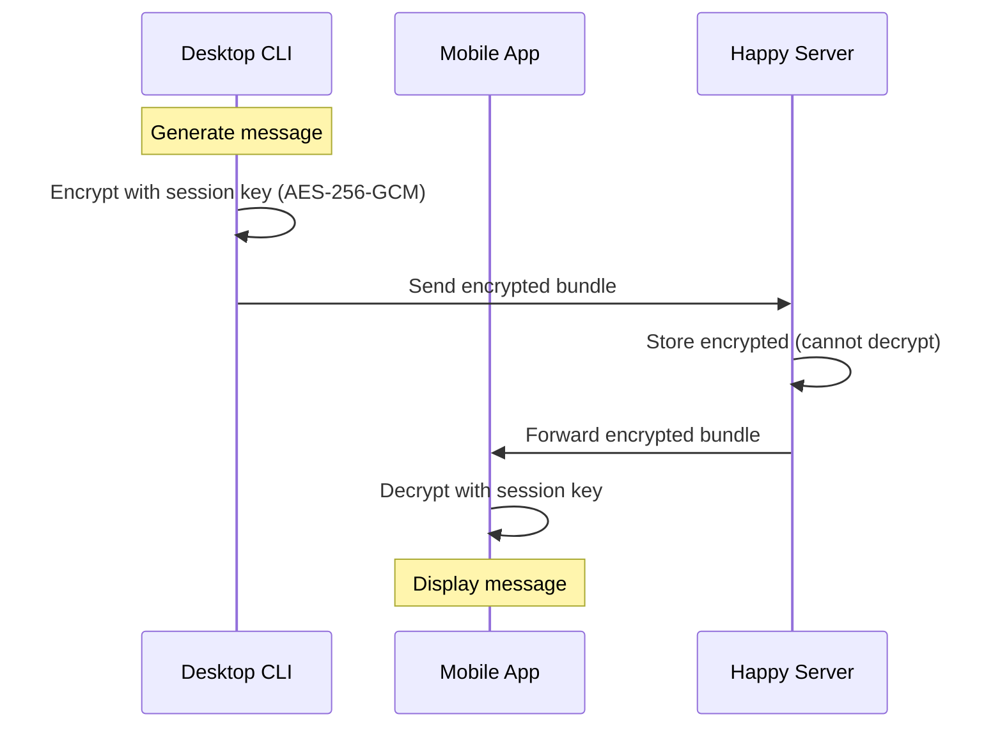

Happy implements end-to-end encryption for all sensitive data, ensuring your code and conversations never leave your devices unencrypted. The system uses industry-standard cryptographic libraries and protocols to maintain privacy and security.

## Encryption Overview

All sensitive data is encrypted on your device before being sent to the Happy server:

<CardGroup cols={2}>
  <Card title="Code & Messages" icon="code">
    Session messages and code snippets are encrypted with AES-256-GCM
  </Card>
  <Card title="Metadata" icon="database">
    Session metadata and settings use TweetNaCl secretbox
  </Card>
  <Card title="Authentication" icon="key">
    Challenge-response protocol with Ed25519 signatures
  </Card>
  <Card title="Key Exchange" icon="arrows-left-right">
    Ephemeral keypairs for secure key sharing
  </Card>
</CardGroup>

## Cryptographic Library

Happy uses **TweetNaCl** (NaCl), a high-security cryptographic library:

- **Audited**: Extensively reviewed and battle-tested
- **Fast**: Optimized implementations for performance
- **Simple**: Clean API reduces implementation errors
- **Portable**: Works across platforms (Node.js, browsers, React Native)

```typescript
import tweetnacl from 'tweetnacl';
```

## Encryption Implementations

### Legacy Encryption (Secretbox)

Used for backward compatibility and simple encryption:

```typescript
// From packages/happy-cli/src/api/encryption.ts

/**
 * Encrypt data using the secret key
 */
export function encryptLegacy(data: any, secret: Uint8Array): Uint8Array {
  const nonce = getRandomBytes(tweetnacl.secretbox.nonceLength);
  const encrypted = tweetnacl.secretbox(
    new TextEncoder().encode(JSON.stringify(data)), 
    nonce, 
    secret
  );
  
  const result = new Uint8Array(nonce.length + encrypted.length);
  result.set(nonce);
  result.set(encrypted, nonce.length);
  return result;
}

/**
 * Decrypt data using the secret key
 */
export function decryptLegacy(data: Uint8Array, secret: Uint8Array): any | null {
  const nonce = data.slice(0, tweetnacl.secretbox.nonceLength);
  const encrypted = data.slice(tweetnacl.secretbox.nonceLength);
  const decrypted = tweetnacl.secretbox.open(encrypted, nonce, secret);
  
  if (!decrypted) {
    return null; // Decryption failed
  }
  
  return JSON.parse(new TextDecoder().decode(decrypted));
}
```

**Key Features:**
- **Algorithm**: XSalsa20-Poly1305 (secretbox)
- **Nonce**: 24 bytes, randomly generated per message
- **Authentication**: Built-in Poly1305 MAC
- **Bundle format**: nonce (24 bytes) + ciphertext + auth tag

### Data Key Encryption (AES-256-GCM)

Used for high-performance encryption of large data:

```typescript
/**
 * Encrypt data using AES-256-GCM with the data encryption key
 */
export function encryptWithDataKey(data: any, dataKey: Uint8Array): Uint8Array {
  const nonce = getRandomBytes(12); // GCM uses 12-byte nonces
  const cipher = createCipheriv('aes-256-gcm', dataKey, nonce);

  const plaintext = new TextEncoder().encode(JSON.stringify(data));
  const encrypted = Buffer.concat([
    cipher.update(plaintext),
    cipher.final()
  ]);

  const authTag = cipher.getAuthTag();

  // Bundle: version(1) + nonce (12) + ciphertext + auth tag (16)
  const bundle = new Uint8Array(12 + encrypted.length + 16 + 1);
  bundle.set([0], 0); // Version byte
  bundle.set(nonce, 1);
  bundle.set(new Uint8Array(encrypted), 13);
  bundle.set(new Uint8Array(authTag), 13 + encrypted.length);

  return bundle;
}

/**
 * Decrypt data using AES-256-GCM with the data encryption key
 */
export function decryptWithDataKey(bundle: Uint8Array, dataKey: Uint8Array): any | null {
  if (bundle.length < 1 || bundle[0] !== 0) {
    return null; // Invalid version
  }
  if (bundle.length < 12 + 16 + 1) {
    return null; // Too short
  }

  const nonce = bundle.slice(1, 13);
  const authTag = bundle.slice(bundle.length - 16);
  const ciphertext = bundle.slice(13, bundle.length - 16);

  try {
    const decipher = createDecipheriv('aes-256-gcm', dataKey, nonce);
    decipher.setAuthTag(authTag);

    const decrypted = Buffer.concat([
      decipher.update(ciphertext),
      decipher.final()
    ]);

    return JSON.parse(new TextDecoder().decode(decrypted));
  } catch (error) {
    return null; // Decryption failed
  }
}
```

**Key Features:**
- **Algorithm**: AES-256 in Galois/Counter Mode
- **Nonce**: 12 bytes, randomly generated
- **Authentication**: Built-in GHASH authentication
- **Bundle format**: version(1) + nonce(12) + ciphertext + auth tag(16)
- **Versioning**: Supports protocol upgrades

## Public Key Encryption

For asymmetric encryption (e.g., sending data to specific users):

```typescript
/**
 * Derive public key from secret seed (libsodium-compatible)
 */
export function libsodiumPublicKeyFromSecretKey(seed: Uint8Array): Uint8Array {
  // Hash seed to match libsodium implementation
  const hashedSeed = new Uint8Array(
    createHash('sha512').update(seed).digest()
  );
  const secretKey = hashedSeed.slice(0, 32);
  return new Uint8Array(
    tweetnacl.box.keyPair.fromSecretKey(secretKey).publicKey
  );
}

/**
 * Encrypt data for a specific recipient's public key
 */
export function libsodiumEncryptForPublicKey(
  data: Uint8Array, 
  recipientPublicKey: Uint8Array
): Uint8Array {
  // Generate ephemeral keypair for this encryption
  const ephemeralKeyPair = tweetnacl.box.keyPair();
  
  // Generate random nonce (24 bytes for box encryption)
  const nonce = getRandomBytes(tweetnacl.box.nonceLength);
  
  // Encrypt the data using box (authenticated encryption)
  const encrypted = tweetnacl.box(
    data, 
    nonce, 
    recipientPublicKey, 
    ephemeralKeyPair.secretKey
  );
  
  // Bundle format: ephemeral public key (32) + nonce (24) + encrypted data
  const result = new Uint8Array(
    ephemeralKeyPair.publicKey.length + nonce.length + encrypted.length
  );
  result.set(ephemeralKeyPair.publicKey, 0);
  result.set(nonce, ephemeralKeyPair.publicKey.length);
  result.set(encrypted, ephemeralKeyPair.publicKey.length + nonce.length);
  
  return result;
}
```

**Key Features:**
- **Algorithm**: X25519-XSalsa20-Poly1305 (NaCl box)
- **Ephemeral keys**: New keypair for each message
- **Forward secrecy**: Compromising one message doesn't affect others
- **Libsodium compatible**: Works with other NaCl implementations

## Authentication System

Happy uses challenge-response authentication:

```typescript
/**
 * Generate authentication challenge response
 */
export function authChallenge(secret: Uint8Array): {
  challenge: Uint8Array
  publicKey: Uint8Array
  signature: Uint8Array
} {
  const keypair = tweetnacl.sign.keyPair.fromSeed(secret);
  const challenge = getRandomBytes(32);
  const signature = tweetnacl.sign.detached(challenge, keypair.secretKey);

  return {
    challenge,
    publicKey: keypair.publicKey,
    signature
  };
}
```

**Flow:**
1. Client generates random 32-byte challenge
2. Client signs challenge with Ed25519 secret key
3. Server verifies signature against public key
4. Server issues authentication token

**Security Properties:**
- **No password transmission**: Secret never leaves device
- **Replay protection**: Each challenge is unique
- **Cryptographic proof**: Ed25519 provides strong authentication

## Base64 Encoding

For safe transmission and storage:

```typescript
/**
 * Encode to standard base64
 */
export function encodeBase64(
  buffer: Uint8Array, 
  variant: 'base64' | 'base64url' = 'base64'
): string {
  if (variant === 'base64url') {
    return encodeBase64Url(buffer);
  }
  return Buffer.from(buffer).toString('base64');
}

/**
 * Encode to URL-safe base64
 */
export function encodeBase64Url(buffer: Uint8Array): string {
  return Buffer.from(buffer)
    .toString('base64')
    .replaceAll('+', '-')
    .replaceAll('/', '_')
    .replaceAll('=', ''); // Remove padding
}

/**
 * Decode from base64
 */
export function decodeBase64(
  base64: string, 
  variant: 'base64' | 'base64url' = 'base64'
): Uint8Array {
  if (variant === 'base64url') {
    // Convert base64url to base64
    const base64Standard = base64
      .replaceAll('-', '+')
      .replaceAll('_', '/')
      + '='.repeat((4 - base64.length % 4) % 4);
    return new Uint8Array(Buffer.from(base64Standard, 'base64'));
  }
  return new Uint8Array(Buffer.from(base64, 'base64'));
}
```

## Random Number Generation

Secure random bytes for nonces and keys:

```typescript
import { randomBytes } from 'node:crypto';

/**
 * Generate secure random bytes
 */
export function getRandomBytes(size: number): Uint8Array {
  return new Uint8Array(randomBytes(size));
}
```

On mobile (React Native):
```typescript
import { getRandomBytesAsync } from 'expo-crypto';

const secret = await getRandomBytesAsync(32);
```

## Key Storage

### CLI (Desktop)

Keys are stored in `~/.happy/access.key` with restricted permissions:

```bash
# Key file permissions: 600 (owner read/write only)
chmod 600 ~/.happy/access.key
```

### Mobile (iOS/Android)

Keys are stored using platform secure storage:

```typescript
import * as SecureStore from 'expo-secure-store';

// Store secret securely
await SecureStore.setItemAsync('happy_secret', encodeBase64(secret));

// Retrieve secret
const secretBase64 = await SecureStore.getItemAsync('happy_secret');
const secret = decodeBase64(secretBase64);
```

**Platform Security:**
- **iOS**: Uses Keychain with kSecAttrAccessibleAfterFirstUnlock
- **Android**: Uses EncryptedSharedPreferences with hardware-backed keystore
- **Web**: Uses localStorage (less secure, not recommended for production keys)

## Encryption Strategy

Unified encryption function with variant selection:

```typescript
export function encrypt(
  key: Uint8Array, 
  variant: 'legacy' | 'dataKey', 
  data: any
): Uint8Array {
  if (variant === 'legacy') {
    return encryptLegacy(data, key);
  } else {
    return encryptWithDataKey(data, key);
  }
}

export function decrypt(
  key: Uint8Array, 
  variant: 'legacy' | 'dataKey', 
  data: Uint8Array
): any | null {
  if (variant === 'legacy') {
    return decryptLegacy(data, key);
  } else {
    return decryptWithDataKey(data, key);
  }
}
```

## Data Flow



**Key Points:**
- Server never has decryption keys
- All encryption/decryption happens on client devices
- Server acts as encrypted message relay

## Security Guarantees

<CardGroup cols={2}>
  <Card title="Confidentiality" icon="eye-slash">
    Data is encrypted before leaving your device. Server cannot read contents.
  </Card>
  <Card title="Integrity" icon="shield-check">
    Authenticated encryption (GCM, Poly1305) prevents tampering.
  </Card>
  <Card title="Forward Secrecy" icon="clock-rotate-left">
    Ephemeral keys ensure past messages stay secure if keys are compromised.
  </Card>
  <Card title="Authentication" icon="fingerprint">
    Ed25519 signatures prove identity without exposing secrets.
  </Card>
</CardGroup>

## Threat Model

### Protected Against
- Server compromise (data stored encrypted)
- Network eavesdropping (TLS + E2E encryption)
- Message tampering (authenticated encryption)
- Replay attacks (unique nonces, challenge-response)

### Not Protected Against
- Device compromise (malware, keyloggers)
- Physical access to unlocked device
- Compromised client app (supply chain attacks)
- Social engineering

## Best Practices

<Steps>
  <Step title="Secure key generation">
    Always use cryptographically secure random number generators. Never hardcode keys or use predictable seeds.
  </Step>
  <Step title="Key rotation">
    Generate new encryption keys periodically. Happy creates new session keys for each conversation.
  </Step>
  <Step title="Secure deletion">
    When deleting sessions, ensure encryption keys are securely wiped from memory and storage.
  </Step>
  <Step title="Device security">
    Use device encryption, strong passwords/biometrics, and keep software updated.
  </Step>
</Steps>

## Audit & Compliance

- **Open Source**: All encryption code is publicly auditable
- **Standard Algorithms**: Uses NIST-approved and widely reviewed algorithms
- **No Custom Crypto**: Relies on established libraries (TweetNaCl, Node.js crypto)
- **Regular Updates**: Dependencies are kept current with security patches

## Performance

Encryption overhead is minimal:

- **AES-256-GCM**: Hardware-accelerated on modern CPUs (~1-2GB/s)
- **TweetNaCl**: Optimized implementations (~100MB/s for secretbox)
- **Negligible latency**: Encryption adds less than 1ms for typical messages

## Next Steps

<CardGroup cols={2}>
  <Card title="Mobile Access" icon="mobile" href="/features/mobile-access">
    Learn how encryption works across platforms
  </Card>
  <Card title="Sandbox Configuration" icon="shield" href="/guides/sandbox-configuration">
    Configure OS-level sandboxing for security
  </Card>
  <Card title="Authentication" icon="key" href="/guides/authentication">
    Learn about secure authentication
  </Card>
  <Card title="Contributing" icon="github" href="/development/setup">
    Help improve Happy
  </Card>
</CardGroup>