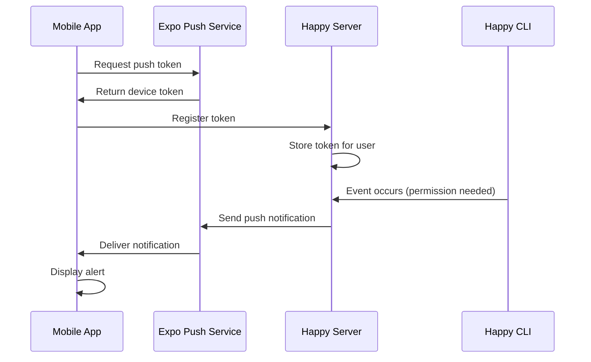

Happy sends push notifications to your mobile device when Claude Code requires input, encounters errors, or completes tasks. Stay informed about your AI coding sessions even when you're away from your computer.

## How It Works

Push notifications are automatically enabled when you install the Happy mobile app. The system uses Expo's push notification service to deliver real-time alerts to your device.

### Notification Flow



## Technical Implementation

### Token Registration

When the mobile app starts, it automatically registers for push notifications:

```typescript
// Push token registration from sync.ts
private registerPushToken = async () => {
  // Only register on mobile platforms
  if (Platform.OS === 'web') {
    return;
  }

  // Request permission
  const { status: existingStatus } = await Notifications.getPermissionsAsync();
  let finalStatus = existingStatus;

  if (existingStatus !== 'granted') {
    const { status } = await Notifications.requestPermissionsAsync();
    finalStatus = status;
  }

  if (finalStatus !== 'granted') {
    console.log('Failed to get push token for push notification!');
    return;
  }

  // Get push token
  const projectId = Constants?.expoConfig?.extra?.eas?.projectId;
  const tokenData = await Notifications.getExpoPushTokenAsync({ projectId });
  
  // Register with server
  await registerPushToken(credentials, tokenData.data);
};
```

### Server API

The Happy server provides REST endpoints for managing push tokens:

#### Register Push Token

```typescript
POST /v1/push-tokens
Authorization: Bearer <token>
Content-Type: application/json

{
  "token": "ExponentPushToken[xxxxxxxxxxxxxxxxxxxxxx]"
}
```

Response:
```json
{
  "success": true
}
```

#### Delete Push Token

```typescript
DELETE /v1/push-tokens/:token
Authorization: Bearer <token>
```

Response:
```json
{
  "success": true
}
```

#### Get All Push Tokens

```typescript
GET /v1/push-tokens
Authorization: Bearer <token>
```

Response:
```json
{
  "tokens": [
    {
      "id": "token-id",
      "token": "ExponentPushToken[xxx]",
      "createdAt": 1234567890,
      "updatedAt": 1234567890
    }
  ]
}
```

### Database Schema

Push tokens are stored in the database with user association:

```typescript
// Prisma model (conceptual)
model AccountPushToken {
  id        String   @id @default(cuid())
  accountId String
  token     String
  createdAt DateTime @default(now())
  updatedAt DateTime @updatedAt
  
  @@unique([accountId, token])
}
```

## Notification Types

Happy sends notifications for various events:

<CardGroup cols={2}>
  <Card title="Permission Requests" icon="shield-check">
    Claude Code needs approval to execute tools or access files
  </Card>
  <Card title="Error Alerts" icon="triangle-exclamation">
    Your AI coding session encountered an error
  </Card>
  <Card title="Task Completion" icon="circle-check">
    Claude Code finished a long-running task
  </Card>
  <Card title="User Input Required" icon="keyboard">
    Claude is waiting for your response
  </Card>
</CardGroup>

## Permission Management

Happy requests notification permissions on first launch:

### iOS
- One-time permission prompt
- Can be managed in iOS Settings → Notifications → Happy
- Supports notification grouping and custom sounds

### Android
- Notification channels for different alert types
- Granular control per notification category
- Android 13+ requires explicit permission grant

### Permission States

```typescript
type NotificationPermissionStatus = 
  | 'granted'    // User approved notifications
  | 'denied'     // User declined notifications
  | 'undetermined' // Not yet asked
```

<Note>
  In development mode (`__DEV__`), push notifications are disabled to avoid unnecessary API calls during testing.
</Note>

## Automatic Token Refresh

The app automatically refreshes push tokens when:
- App returns to foreground
- User logs in or restores account
- Token expires or becomes invalid

```typescript
// App state listener triggers token refresh
AppState.addEventListener('change', (nextAppState) => {
  if (nextAppState === 'active') {
    // Invalidate push token sync to refresh
    this.pushTokenSync.invalidate();
  }
});
```

## Expo Push Notification Service

Happy uses Expo's push notification infrastructure:

- **Cross-platform**: Works on both iOS and Android
- **Reliable delivery**: High success rate with automatic retries
- **Free tier**: Included with Expo
- **FCM/APNs integration**: Uses Firebase Cloud Messaging and Apple Push Notification service

### Token Format

Expo push tokens follow this format:
```
ExponentPushToken[xxxxxxxxxxxxxxxxxxxxxx]
```

## Privacy & Security

Push notifications are designed with privacy in mind:

<Steps>
  <Step title="Token Storage">
    Push tokens are stored server-side with user association but no device metadata
  </Step>
  <Step title="Secure Transmission">
    All API calls use HTTPS with bearer token authentication
  </Step>
  <Step title="No Content in Notifications">
    Sensitive code or data is never included in push notification payloads
  </Step>
  <Step title="User Control">
    Users can disable notifications at any time through system settings
  </Step>
</Steps>

## Troubleshooting

### Not Receiving Notifications?

<AccordionGroup>
  <Accordion title="Check notification permissions">
    Verify that Happy has notification permissions in your device settings.
    
    **iOS**: Settings → Notifications → Happy  
    **Android**: Settings → Apps → Happy → Notifications
  </Accordion>
  
  <Accordion title="Verify token registration">
    The app should automatically register on launch. If issues persist, try logging out and back in.
  </Accordion>
  
  <Accordion title="Network connectivity">
    Ensure your device has an active internet connection. Push notifications require connectivity to Expo's push service.
  </Accordion>
  
  <Accordion title="Development mode">
    Push notifications are disabled in development builds (`__DEV__`). Use a production build to test notifications.
  </Accordion>
</AccordionGroup>

### Platform-Specific Issues

<Tabs>
  <Tab title="iOS">
    - Notifications may be delayed if Low Power Mode is enabled
    - Silent notifications require proper background mode configuration
    - APNs requires proper provisioning profiles
  </Tab>
  <Tab title="Android">
    - Some manufacturers (Xiaomi, Huawei) aggressively kill background apps
    - Notification channels must be properly configured
    - FCM requires valid `google-services.json`
  </Tab>
</Tabs>

## Configuration

Push notifications work out of the box with default settings. For advanced configuration:

```typescript
// Notification handler configuration
Notifications.setNotificationHandler({
  handleNotification: async () => ({
    shouldShowAlert: true,
    shouldPlaySound: true,
    shouldSetBadge: false,
  }),
});
```

## Next Steps

<CardGroup cols={2}>
  <Card title="Mobile Access" icon="mobile" href="/features/mobile-access">
    Learn about the mobile apps for iOS and Android
  </Card>
  <Card title="Device Switching" icon="arrows-rotate" href="/features/device-switching">
    Switch control between desktop and mobile
  </Card>
  <Card title="Server Component" icon="server" href="/components/server">
    Explore the server architecture and API
  </Card>
</CardGroup>