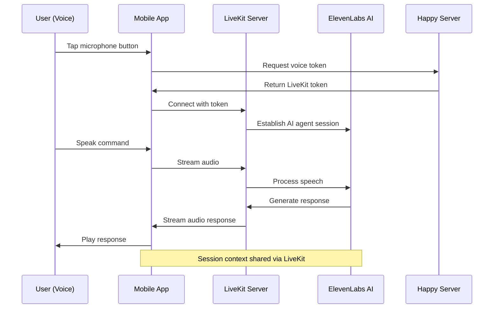

Happy integrates voice control powered by **ElevenLabs AI** and **LiveKit** for real-time voice communication. Talk to your AI coding assistant naturally while reviewing code or working on tasks that require both hands.

## Overview

Voice control transforms your mobile device into a voice assistant for Claude Code:

- **Natural conversation**: Speak to Claude as you would to a colleague
- **Real-time responses**: Low-latency voice streaming with LiveKit
- **Session awareness**: Voice assistant has full context of your active sessions
- **Multi-language support**: Configure your preferred language for voice interaction

<Note>
  Voice control is currently in **experimental preview**. Enable it in Settings → Experiments to try it out.
</Note>

## How It Works



## Technical Architecture

### LiveKit Integration

Happy uses **LiveKit** for real-time voice communication:

```json
// From package.json dependencies
{
  "@livekit/react-native": "^2.9.0",
  "@livekit/react-native-webrtc": "^137.0.0",
  "livekit-client": "^2.15.4"
}
```

### ElevenLabs AI Agent

Voice processing is handled by ElevenLabs:

```json
{
  "@elevenlabs/react": "^0.12.3",
  "@elevenlabs/react-native": "^0.5.7"
}
```

### Platform-Specific Implementation

The voice session has separate implementations for native and web:

- **Native**: `RealtimeVoiceSession.tsx` (iOS/Android)
- **Web**: `RealtimeVoiceSession.web.tsx` (browser)

## Starting a Voice Session

### From the Mobile App

```typescript
// From packages/happy-app/sources/realtime/RealtimeSession.ts

export async function startRealtimeSession(
  sessionId: string, 
  initialContext?: string
) {
  // Request microphone permission first
  const permissionResult = await requestMicrophonePermission();
  if (!permissionResult.granted) {
    showMicrophonePermissionDeniedAlert(permissionResult.canAskAgain);
    return;
  }

  const experimentsEnabled = storage.getState().settings.experiments;
  const agentId = __DEV__ 
    ? config.elevenLabsAgentIdDev 
    : config.elevenLabsAgentIdProd;
  
  if (!agentId) {
    console.error('Agent ID not configured');
    return;
  }
  
  // Simple path: No experiments = no auth needed
  if (!experimentsEnabled) {
    voiceSessionStarted = true;
    await voiceSession.startSession({
      sessionId,
      initialContext,
      agentId
    });
    return;
  }
  
  // Experiments enabled = full auth flow
  const credentials = await TokenStorage.getCredentials();
  const response = await fetchVoiceToken(credentials, sessionId);

  if (!response.allowed) {
    // Present paywall if not subscribed
    const result = await sync.presentPaywall();
    if (result.purchased) {
      await startRealtimeSession(sessionId, initialContext);
    }
    return;
  }

  voiceSessionStarted = true;
  
  if (response.token) {
    // Use token from backend
    await voiceSession.startSession({
      sessionId,
      initialContext,
      token: response.token,
      agentId: response.agentId
    });
  } else {
    // No token - use agentId directly
    await voiceSession.startSession({
      sessionId,
      initialContext,
      agentId
    });
  }
}
```

### Stopping a Voice Session

```typescript
export async function stopRealtimeSession() {
  if (!voiceSession) {
    return;
  }
  
  voiceSessionStarted = false;
  currentSessionId = null;
  await voiceSession.stopSession();
}
```

## Voice Context System

The voice assistant receives context about your active sessions:

### Context Hooks

```typescript
// From packages/happy-app/sources/realtime/hooks/voiceHooks.ts

export const voiceHooks = {
  /**
   * Called when voice session starts
   */
  onVoiceStarted(sessionId: string): string {
    let prompt = 'THIS IS AN ACTIVE SESSION: \n\n' + 
      formatSessionFull(
        storage.getState().sessions[sessionId],
        storage.getState().sessionMessages[sessionId]?.messages ?? []
      );
    return prompt;
  },

  /**
   * Called when user navigates to/views a session
   */
  onSessionFocus(sessionId: string, metadata?: SessionMetadata) {
    reportSession(sessionId);
    reportContextualUpdate(
      formatSessionFocus(sessionId, metadata)
    );
  },

  /**
   * Called when agent sends a message/response
   */
  onMessages(sessionId: string, messages: Message[]) {
    reportSession(sessionId);
    reportContextualUpdate(
      formatNewMessages(sessionId, messages)
    );
  },

  /**
   * Called when Claude requests permission for a tool use
   */
  onPermissionRequested(
    sessionId: string, 
    requestId: string, 
    toolName: string, 
    toolArgs: any
  ) {
    reportSession(sessionId);
    reportTextUpdate(
      formatPermissionRequest(sessionId, requestId, toolName, toolArgs)
    );
  },

  /**
   * Called when Claude Code finishes processing
   */
  onReady(sessionId: string) {
    reportSession(sessionId);
    reportTextUpdate(formatReadyEvent(sessionId));
  }
};
```

### Context Updates

Two types of updates are sent to the voice assistant:

```typescript
// Contextual updates (background information)
function reportContextualUpdate(update: string) {
  const voice = getVoiceSession();
  if (!voice || !isVoiceSessionStarted()) return;
  voice.sendContextualUpdate(update);
}

// Text updates (direct messages)
function reportTextUpdate(update: string) {
  const voice = getVoiceSession();
  if (!voice || !isVoiceSessionStarted()) return;
  voice.sendTextMessage(update);
}
```

## Voice Configuration

Customize voice assistant behavior:

```typescript
// From packages/happy-app/sources/realtime/voiceConfig.ts

export const VOICE_CONFIG = {
  /** Disable all tool call information from being sent to voice context */
  DISABLE_TOOL_CALLS: false,
  
  /** Send only tool names and descriptions, exclude arguments */
  LIMITED_TOOL_CALLS: true,
  
  /** Disable permission request forwarding */
  DISABLE_PERMISSION_REQUESTS: false,
  
  /** Disable session online/offline notifications */
  DISABLE_SESSION_STATUS: true,
  
  /** Disable message forwarding */
  DISABLE_MESSAGES: false,
  
  /** Disable session focus notifications */
  DISABLE_SESSION_FOCUS: false,
  
  /** Disable ready event notifications */
  DISABLE_READY_EVENTS: false,
  
  /** Maximum number of messages to include in session history */
  MAX_HISTORY_MESSAGES: 50,
  
  /** Enable debug logging for voice context updates */
  ENABLE_DEBUG_LOGGING: true,
} as const;
```

## Language Settings

Configure your preferred language for voice interaction:

```typescript
// From packages/happy-app/sources/app/(app)/settings/voice.tsx

export default function VoiceSettingsScreen() {
  const [voiceAssistantLanguage] = useSettingMutable('voiceAssistantLanguage');
  
  return (
    <ItemList>
      <ItemGroup 
        title={t('settingsVoice.languageTitle')}
        footer={t('settingsVoice.languageDescription')}
      >
        <Item
          title={t('settingsVoice.preferredLanguage')}
          subtitle={t('settingsVoice.preferredLanguageSubtitle')}
          icon={<Ionicons name="language-outline" size={29} color="#007AFF" />}
          detail={getLanguageDisplayName(currentLanguage)}
          onPress={() => router.push('/settings/voice/language')}
        />
      </ItemGroup>
    </ItemList>
  );
}
```

### Supported Languages

The voice assistant supports multiple languages. Configure in:
**Settings → Voice → Preferred Language**

## Microphone Permissions

Voice control requires microphone access:

### iOS

```xml
<!-- Info.plist -->
<key>NSMicrophoneUsageDescription</key>
<string>Happy needs microphone access for voice control of Claude Code</string>
```

### Android

```xml
<!-- AndroidManifest.xml -->
<uses-permission android:name="android.permission.RECORD_AUDIO" />
```

### Permission Flow

```typescript
import { requestMicrophonePermission } from '@/utils/microphonePermissions';

const permissionResult = await requestMicrophonePermission();

if (!permissionResult.granted) {
  if (permissionResult.canAskAgain) {
    // Show explanation and prompt again
  } else {
    // Direct user to system settings
    showMicrophonePermissionDeniedAlert(false);
  }
}
```

## Voice Session Lifecycle

### State Management

```typescript
let voiceSession: VoiceSession | null = null;
let voiceSessionStarted: boolean = false;
let currentSessionId: string | null = null;

export function registerVoiceSession(session: VoiceSession) {
  voiceSession = session;
}

export function getVoiceSession(): VoiceSession | null {
  return voiceSession;
}

export function isVoiceSessionStarted(): boolean {
  return voiceSessionStarted;
}

export function getCurrentRealtimeSessionId(): string | null {
  return currentSessionId;
}
```

### Session Events

1. **Start**: User taps microphone button
2. **Permission check**: Request microphone access
3. **Token fetch**: Get LiveKit credentials (if experiments enabled)
4. **Connection**: Establish LiveKit connection
5. **Context load**: Send initial session context to AI
6. **Active**: Voice communication enabled
7. **Updates**: Real-time context updates as session changes
8. **Stop**: User ends voice session or navigates away

## WebRTC Configuration

LiveKit uses WebRTC for low-latency audio streaming:

```typescript
// Native WebRTC support
import '@config-plugins/react-native-webrtc';
import '@livekit/react-native-webrtc';

// WebRTC provides:
// - Peer-to-peer audio streaming
// - Adaptive bitrate
// - Echo cancellation
// - Noise suppression
```

## Performance Optimizations

### Lazy Loading

Voice components are loaded only when needed:
- Voice session UI loads on demand
- WebRTC libraries initialized lazily
- AI connection established only when active

### Context Throttling

Context updates are accumulated and batched:

```typescript
class ActivityUpdateAccumulator {
  private flushDelay = 2000; // 2 second batching
  
  accumulate(update: Update) {
    // Buffer updates
  }
  
  flush() {
    // Send batched updates to voice assistant
  }
}
```

### Connection Pooling

LiveKit connections are reused across voice sessions:
- Single WebRTC connection per device
- Connection maintained in background
- Automatic reconnection on network changes

## Debugging Voice Issues

<AccordionGroup>
  <Accordion title="No audio input">
    - Check microphone permissions in system settings
    - Verify microphone works in other apps
    - Ensure app has focus and isn't backgrounded
    - Check for Bluetooth headset issues
  </Accordion>
  
  <Accordion title="No audio output">
    - Verify device volume is up
    - Check Do Not Disturb / Silent mode
    - Try toggling speaker/earpiece
    - Restart the voice session
  </Accordion>
  
  <Accordion title="High latency">
    - Check network connection quality
    - Ensure stable WiFi or cellular
    - Close bandwidth-heavy apps
    - LiveKit automatically adapts to network conditions
  </Accordion>
  
  <Accordion title="Connection fails">
    - Verify experiments are enabled (Settings → Experiments)
    - Check subscription status if using authenticated mode
    - Ensure agent ID is configured correctly
    - Review app logs for token fetch errors
  </Accordion>
</AccordionGroup>

## Privacy & Data

<CardGroup cols={2}>
  <Card title="Audio Processing" icon="waveform">
    Audio is processed by ElevenLabs AI in real-time and not permanently stored
  </Card>
  <Card title="Context Sharing" icon="share-nodes">
    Only relevant session context is sent to the voice AI for better responses
  </Card>
  <Card title="Encrypted Transit" icon="lock">
    All voice data is transmitted over encrypted WebRTC connections
  </Card>
  <Card title="User Control" icon="hand">
    Voice sessions can be started and stopped at any time
  </Card>
</CardGroup>

## Future Enhancements

Planned improvements for voice control:

- **Wake word detection**: Hands-free activation
- **Voice commands**: Direct actions ("approve permission", "switch to desktop")
- **Custom voices**: Choose AI voice personality
- **Offline mode**: On-device speech recognition
- **Voice shortcuts**: Create custom voice macros

## Next Steps

<CardGroup cols={2}>
  <Card title="Mobile Access" icon="mobile" href="/features/mobile-access">
    Learn about the mobile app platforms
  </Card>
  <Card title="Device Switching" icon="arrows-rotate" href="/features/device-switching">
    Control sessions from voice or keyboard
  </Card>
  <Card title="Settings" icon="gear" href="/guides/settings">
    Configure voice preferences
  </Card>
  <Card title="Experiments" icon="flask" href="/guides/experiments">
    Enable experimental features
  </Card>
</CardGroup>